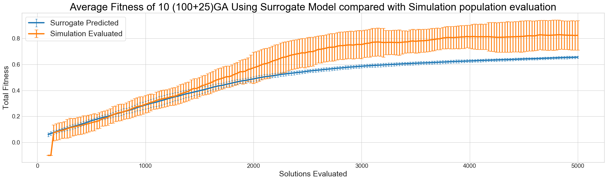

title: Large-Scale Road Network Simulations for Smart Cities
shorttitle: S9387 - Large-Scale Road Network Simulations for Smart Cities
authors: Peter Heywood, Paul Richmond, Steve Maddock, Rob Chisholm, James Pyle
shortauthors: Peter Heywood
institute: The University of Sheffield
class: animation-fade
layout: true

.bottom-bar[
.col-8[
{{shorttitle}}
]
.pull-right[
{{shortauthors}}, {{institute}}
]
]

<!-- @todo - steal stuff from pauls slides http://on-demand.gputechconf.com/gtc/2018/presentation/s8223-simulating-a-city-gpu-simulations-of-traffic-crowds-and-beyond.pdf -->
<!-- @todo talk ouitline slide. -->

---

class: impact

# {{title}}
## {{authors}}
### {{institute}}
.uni-logo[

]

---

class: impact
# Smart City Simulation

---

# Smart Cities

.col-6[
+ Data-driven transport management
+ **Improve** utilisation and efficiency etc.
+ **Reduce** congestion and pollution etc.
    

+ Transport demand is increasing <!-- @todo - cite -->
    + Across all modes of transport
    + **@todo - Road statistic**
    + **@todo - Rail statistic**
    + **@todo - Air statistic**
+ New modes of transport appearing
    + I.e Connected Autonomous Vehicles (CAVs)
]
.col-6.img-col[
.w-90[

]
]

---

# Smart City Transport Simulation
.col-6[

+ Goals can be achieved through **simulation**
    + Planning
    + Management

+ Cities are challenging
    + High population density
    + Co-located modes

+ Limitations on possible interventions
    + Space
    + Air Quality
    + Money

]
.col-6.img-col[

.caption[
[CC BY 2.0](http://creativecommons.org/licenses/by/2.0/)
Highways England 

[https://www.flickr.com/photos/highwaysagency/9950013283/](https://www.flickr.com/photos/highwaysagency/9950013283/)
]
]

---

# Transport Network Simulation Resolution
.col-7[
+ **Macroscopic** (Top-Down)
    + Simulate aggregate flows across links
    + *Low Resolution*
    + *Lowest Computational Cost*

+ **Mesoscopic**
    + Simulate platoons consisting of multiple vehicles

+ **Microscopic** (Bottom-up)
    + Simulate individual vehicles or people
    + *High Resolution*
    + *Very High Cost*
]
.col-5.img-col[
.w-80[

]
]

---

# Computational Challenges
.col-6[
+ Smart city simulations are **massively** computationally expensive
    + **Large** 
        - Potentially *millions* of individuals
    + **Complex** 
        - Smarter Infrastructure
        - Multi-mode
        - CAVs
    + **Many Permutations** 
        - Weather, Demand, etc.

+ Performance is limiting the use of simulation in industry <!-- [cite] --> <!-- @todo -->
    + Even for smaller-scale simulations
+ **Faster simulators are required** 
]
.col-6.img-col[
.w-90[

]
]

???
@todo new picture

---

class: impact
# CPU Microsimulation

+ @todo - subpoints

---

# Microsimulation and Agent Based Modelling

.col-6[
+ Bottom-Up Simulation
+ Individual Vehicles
    + Own properties and behaviour
    + Interact with others
    + Interact with environment

+ Can be implemented with Agent Based Modelling (ABM)
    + Intuitive method of describing models
    + Complex behaviour emerges from simple rules

+ **Huge computational cost**
+ Large volumes of data required
+ Highly Stochastic
    + Many runs required
]
.col-6.img-col[
.w-90[

.caption[FLAME GPU Road Network Microscopic Simulation]
]
]

---

# Commercial Microsimulation tools

.col-6[
+ Many commercial and open source simulators
    + Aimsun
    + PTV Vissim
    + Parasim
    + SUMO
    + etc.
+ All CPU-based simulators
    + Single-threaded or Multi-threaded
+ Poor scaling with processor cores
+ Poor scaling with transport network size
]
.col-6.img-col[
.w-90[

]
]

---

# Our Goals / Aims (@todo rename this slide.)

.col-6[
+ Demonstrate GPUs are suitable for Smart-City Simulations
    + Suitable for large-scale networks
    + Offer better-than-real-time performance

+ Achieved this by:
    + Implement subset of models from a commercial tool
    + Cross-validate GPU implementation
    + Benchmark using a scalable model
]
.col-6.img-col[
.w-90[

.caption[Nvidia Titan Xp and Titan V GPUs]
]
]

---

# Reference CPU Simulator)

@todo - This slide needs to show that to achieve our goals we need to do something. What are we simulating. A standardised benchmark

.col-6[
+ Aimsun 8.1
+ Multi-core CPU simulator
+ Used Globally within transport industry
+ Capable of modelling almost any transport scenario

+ Diminishing returns above 8 CPU cores
]
.col-6.img-col[
.w-90[
.w-60[

]
www.aimsun.com
]
]

---

# Selected Microsimulation Models (@todo Standardised Benchmark / Control Models)

.col-6[
+ Several models implemented
+ Gipps' Car Following Model
+ Aimsun Gap Acceptance Model
+ Turning Probability routing
+ Simulated Detectors
+ Constant Vehicle Arrival
+ Yellow-box junctions
]
.col-6.img-col[
.w-90[
<!--  -->
*@todo - image*
]
]

---

# Benchmark Network

.col-5.vcent-col[
+ Manhattan-style grid network
+ Single lane, one-way roads
+ Stop-signs at junctions
+ Entrances and exits at the edges of the simulation
]
.col-7.img-col[
.w-99[

]
]

---

# Aimsun Benchmarking

.col-6[
+ Benchmarked Aimsun 8.1 at multiple scales
+ 1 hour simulation
+ Intel i7 4770k
+ Average runtime from 3 repetitions

+ Largest Simulation which ran to completion
    + ~ 0.5 million vehicles
    + 5447 seconds
    + **1.5x slower than real time**

+ **Too slow for real-time predictive management**
]
.col-6.img-col[
.w-99[

]
]
<!-- @todo - linear or log -->

---

class: impact
# GPU Microsimulation

+ @todo Add bullets

---

# FLAME GPU
.col-6[

+ Flexible Large-Scale Agent Modelling Environment for the GPU
+ Template-based simulation environment for high performance simulation
+ Agents (individuals) represented as X-Machines
    + with *message lists* for communication
+ Abstracts the CUDA programming model away from the user

]
.col-6.img-col[
.w-90[
.center.w-40[

]

flamegpu.com

github.com/flamegpu/

**@todo Generic FLAME GPU images**
]
]

---

# FLAME GPU Code Generation Process

.col-12.img-col[
.w-70[

]
]

+ **@todo - Add snippets of XML and C code from github?**

---

# Why use FLAME GPU?

.col-6[
+ State-based representation minimises divergence
+ SoA per state list - improves data access pattern
+ Message lists avoid race-conditions
    + Natural synchronisation barriers
+ Reduce global reads via shared memory
]
.col-6.img-col[
.w-90[

]
]

---

# @todo overviewy slide linking advantages and state diagram - 

+ @todo - Repeat the selected models slide? 

---

# Implementation State Diagram

.col-9.img-col[
.w-99[

]
]
<!-- .col-3.vcent-col[ -->
.col-3[
.smaller[
+ Vehicles only
+ 3 States
+ Represents 1 iteration
+ Functions within layer execute concurrently
]
]

---

<!-- Old Vis slide converted to validation -->
# Validation of GPU Implementation

.col-4[
+ Cross Validated against Aimsun 8.1
+ 6 sets of validation networks, targeting different models
    + Deterministic tests reproduced exactly
    + Stochastic test reproduced within acceptable range
]
.col-8.responsive[
<video width="1920" height="1080" controls loop muted poster="video/ttrig-1080p30.png">
    <source src="video/ttrig-1080p30.webm" type="video/webm">
  Your browser does not support the video tag.
</video>

]

---

# Validation of GPU Implementation
.col-4[
+ Cross Validated against Aimsun 8.1
+ 6 sets of validation networks, targeting different models
    + Deterministic tests reproduced exactly
    + Stochastic test reproduced within acceptable range
]
.col-8.img-col[
.w-90[

.caption[Vadliation of Gipps' Car following model Scenario]
**@todo - Change X Label of this image! Time(s) not Iteration!**
]
]

<!-- @todo - remove FLAME GPU from titles where not needed. -->

---
class: impact

# Agent Communication

+ Existing Communication Strategies
+ Graph Based Communication
+ Benchmark Results

---

# FLAME GPU Communication

+ Message lists used to communicate
    + Avoids issues with concurrent access to agent memory
    + Enables good use of cache and memory hierarchy
+ Typically the performance-limiting factor in large-scale simulations
+ Specialisation for typical communication patterns <!-- \cite{Richmond2011b} -->
    + All-to-All
    + Discrete Partitioned Messaging  (2D Cellular Automata)
    + Spatially Partitioned Messaging (2D and 3D Continuous Agents)
+ Non-optimal for road network models

---

# FLAME GPU Communication Benchmarking

.col-4[
+ Benchmarked multiple scales using alternate communication strategies
+ NVidia Titan V
+ Average runtime from 3 repetitions
+ Poor Performance
+ **Majority of runtime spent iterating messages!**
+ **@todo - popsize-gridsize-brute-spatial-linear.png**
]
.col-8.img-col[
.w-90[

]
]

---

# Graph Based Communication

.col-8[
+ Communication between vehicles is based on the road network
+ I.e. Car following models may only involve the lead vehicle
+ Associates message to the graph data structure of the road network
+ Reduces the number of messages to be iterated by each agent
    + By only accessing messages from the relevant edge(s) of the network.

| Communication Strategy | # Messages | 
|------------------------|------------|
| All-to-all             |         42 |
| Spatial                |         18 |
| Graph                  |          5 |

]
.col-4.img-col[
.w-99[

]
]

---

# Graph Based Communication

+ Compressed Sparse Row (CSR) representation of graph 
+ Messages contain edge or vertex index
+ Sort message list based on edge (or vertex) index
    + *Counting Sort*
    + Shared-memory atomics 
    + Builds data structure to access messages whilst sorting
+ Can access a single edge, or use the CSR to explore the message-list
+ Agents on the same edge are executed on neighbouring threads
+ Available as of FLAME GPU 1.5.0

---

# Graph Based Communication Performance

.col-12[
    + Measured performance of message list output and iteration for car following model
    + Higher output cost, but **much, much** cheaper message iteration cost
]
.col-6[.w-90[

]]
.col-6.img-col[.w-90[

]]
<!-- @todo - checkl the formatting of the above images. Should be top aligned. -->

---

# Grid size performance (@todo rename)

.col-4[
+ Re-ran benchmark using graph-based communication
+ NVidia Titan V
+ Average runtime from 3 repetitions
+ **Significant performance improvement!**
]
.col-8.img-col[
.w-90[

]
]

---

# Grid size performance (@todo rename)

.col-4[
+ Re-ran benchmark using graph-based communication
+ NVidia Titan V
+ 3 repetitions

+ 0.5 million vehicles
    + 82.04 seconds
    + **66x faster than CPU**
    + **44x faster than real-time**

]
.col-8.img-col[
.w-90[

]
]

<!-- @Todo check all captions / alt textx -->

---

# Run-time per Simulation Iteration
.col-6.img-col[
.w-90[

]
]

.col-6[
+ Measured runtime per simulation iteration
+ i7 4770k vs Titan X (Pascal)
+ 256 x 256 grid
+ total demand of 256,000 vehicles
+ Runtime increases per iteration as population grows
+ Periodic detector behaviour causes runtime increases
]

---

# Input Flow Benchmarks

.col-8.img-col[
.w-90[

<!-- @todo - Titan V vs CPU figure? -->
]
]
.col-4[
+ Fixed network size
+ Varied input flow of vehicles per edge
    + I.e. vehicle density
+ 64 x 64 grid
]
---

# Input Flow Benchmarks

.col-8.img-col[
.w-90[

<!-- @todo - Titan V vs CPU figure? -->
]
]
.col-4[
+ Fixed network size
+ Varied input flow of vehicles per edge
    + I.e. vehicle density
+ 128 x 128 grid
]

---

# Input Flow Benchmarks

.col-8.img-col[
.w-90[

<!-- @todo - Titan V vs CPU figure? -->
]
]
.col-4[
+ Fixed network size
+ Varied input flow of vehicles per edge
    + I.e. vehicle density
+ 256 x 256 grid
]

---

class: impact 
# Future Work and Improvements (@todo)

+ Functionality
+ Multi-Mode Simulations
+ Machine Learning and Simulation in Combination
+ FLAME GPU 2

---

# Expand Functionality / More complete road network simulation. (@todo)

.col-8[
+ Only implemented a subset of functionality
+ Implement missing functionality to enable real-world simulations
    + I.e. Multiple lanes
    + Dynamic infrastructure
    + etc.
+ Room for further optimisation
]
.col-4.img-col[
.w-90[
<!--  -->
*@todo - image*
]
]

---

# Multi-Mode Simulation: Pedestrians

.col-4[
+ GPUs suitable for many modes of transport 
+ Including Pedestrian Simulation
+ Existing Pedestrian simulations implemented in FLAME GPU
+ Can simulate 100,000s of pedestrians
+ **Combine with road network simulation for shared environments**
]
.col-8.responsive[
<video width="1920" height="1080" controls loop muted poster="video/ped-london-1080p25.png">
    <source src="video/ped-london-1080p25.webm" type="video/webm">
  Your browser does not support the video tag.
</video>

]
---

# Multi-Mode Simulation: Pedestrians and Rail

<!-- + Rail - CPU is good enough (S2AM) -->
<!-- + S2AM Video -->
<!-- + Namedrop Siemens, Rob and Paul. -->

.col-6[
+ Collaboration with Siemens
+ Multi-modal Smart-City Simulation
    + CPU based rail simulation
    + GPU accelerated pedestrian simulation
    + CPU based road network simulation (SUMO)
+ Evaluate rail network performance including pedestrian behaviours in station 
+ More information: [youtube.com/watch?v=Rz_XzbZIMes](https://www.youtube.com/watch?v=Rz_XzbZIMes)
+ **Robert Chisholm** [r.chisholm@sheffield.ac.uk](mailto:r.chisholm@sheffield.ac.uk)
]
.col-6.responsive[
<video width="1920" height="2160" controls loop muted poster="video/S2AM.png">
    <source src="video/S2AM.webm" type="video/webm">
  Your browser does not support the video tag.
</video>

]

---

# Deep Learning

.col-6[
+ Train DL to predict simulator output
+ Shout out for James.
+ Compliment real world data with simulated data for un-observed situations
+ @todo - Ask James how to summaries his work in 1 slide.
+ **James Pyle** [jcbpyle1@sheffield.ac.uk](mailto:jcbpyle1@sheffield.ac.uk)
]
.col-6.img-col[
.w-100[

]
]

---

# Machine Learning and Simulation in Combination

.col-6[
.smaller[
+ Train **Surrogate Models**
    + Machine learning models which *predict the output of a complex system simulation*
    + Useful for calibration, validation, optimisation, etc 
+ I.e. Search parameter space using surrogate model
    + Simulate interesting parameters sets
    + Much faster than simulating whole parameter space
]
]
.col-6[
.smaller[
+ Transport simulation surrogate model 
+ Train with:
    + Real-world data
    + Simulated data
        + **including low-frequency events**
+ *Accurate*, *Robust* predictions

+ **James Pyle** [jcbpyle1@sheffield.ac.uk](mailto:jcbpyle1@sheffield.ac.uk)
]
]
.col-9[

]
.col-3[
.smaller[
+ Genetic Algorithm driven search
+ Simple Neural Network surrogate
+ 500x faster than simulation
    + Less accurate
]
]

---

# FLAME GPU 2

.col-8[
+ Redeveloped from the ground-up
+ Under active development, aiming for an initial release this year
+ Increased flexibility
+ Improved performance
+ More maintainable code-base (Modern C++, no more XSLT)
+ New functionality
    + Automatic parameter exploration / tuning
    + Run many small simulations concurrently one one device
    + Multi GPU?
+ Lower barrier to entry
    + Python bindings (other languages/)
+ github.com/flamegpu2_dev
]
.col-4.img-col[
.w-90[

*@todo - image*
]
]
 
---

class: impact

# Conclusions

---

# Conclusion

.col-6[

+ **Faster-than-real-time city-scale microsimulation is achievable**

+ Simulation of 500,000 vehicles
    + **44x faster than real-time**
    + **66x faster than reference simulator**

+ Achieved using FLAME GPU
    + New graph-based agent communication strategy
    + Cross-validated against Aimsun 8.1 
    + FLAME GPU 2 is under development
]
.col-6.img-col[
.w-90[

<!-- @todo - increase contrast of picture ? -->
]
]
---

# Thank You

.smaller[
.col-4[
#### Contact
+ Peter Heywood
    + p.heywood@sheffield.ac.uk
    + [ptheywood.uk](http://ptheywood.uk)

+ Paul Richmond
    + p.richmond@sheffield.ac.uk
    + [paulrichmond.shef.ac.uk](http://paulrichmond.shef.ac.uk)

.w-60[

]
.w-60[

]
<!-- rse.shef.ac.uk -->
<!-- shef.ac.uk -->

]
.col-7.offset-1[
#### Supported by
+ EPSRC fellowship “Accelerating Scientific Discovery with Accelerated Computing” (EP/N018869/1)
+ DfT Transport Technology Research Innovation Grant (T-TRIG July 2016)

#### More Information

*"Data-parallel agent-based microscopic road network simulation using graphics processing units"* 
    
Peter Heywood, Steve Maddock, Jordi Casas, David Garcia, Mark Brackstone & Paul Richmond. 2017 

[doi.org/10.1016/j.simpat.2017.11.002](https://doi.org/10.1016/j.simpat.2017.11.002)

]
]
