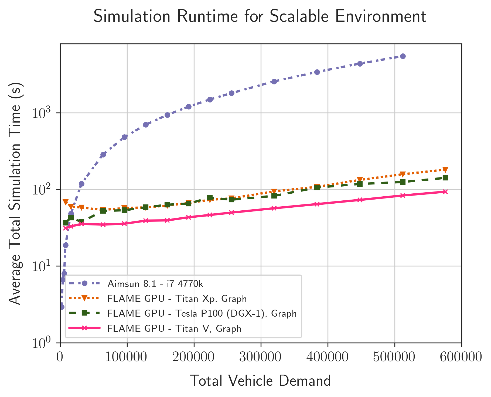
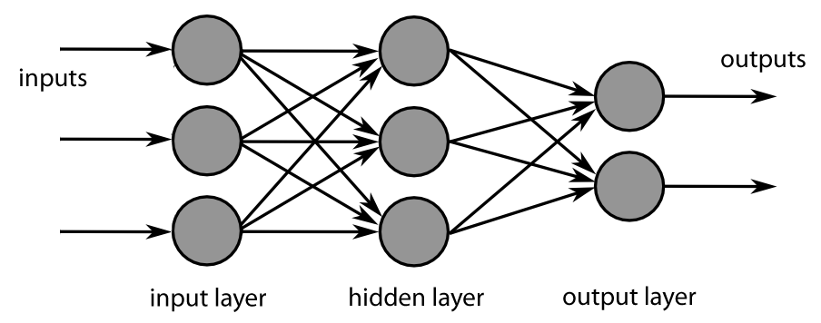

title: Large-Scale Road Network Simulations for Smart Cities
shorttitle: S9387 - Large-Scale Road Network Simulations for Smart Cities
mainauthor: Peter Heywood
otherauthors: Paul Richmond, Steve Maddock, Rob Chisholm, James Pyle
institute: The University of Sheffield
class: animation-fade
layout: true

.bottom-bar[
.col-8[
{{shorttitle}}
]
.pull-right[
{{mainauthor}}, {{institute}}
]
]

<!-- @todo - Check all figures. Colours. Alt text. Labels / Captions -->
<!-- @todo - Check / improve titles -->

---

class: impact

# {{title}}
## {{mainauthor}}, {{otherauthors}}
### {{institute}}

---

class: impact
# Smart City Simulation

+ Smart Cities
+ Transport Simulation
+ Computational Challenges

---

# Smart Cities

.col-6[
+ Data-driven transport management
+ **Improve** utilisation and efficiency
+ **Reduce** congestion and pollution
    

+ 31% growth in UK motorway traffic by 2041 [1]

+ High Congestion in Cities
    + Travel Speeds reduced by 58% in London  [2]

        <table class="margin-0">
            <tr>
                <td>Peak</td>
                <td class="td-right">15.6 mph</td>
            </tr>
            <tr>
                <td>Free Flow</td>
                <td class="td-right">36.9 mph</td>
            </tr>
        </table>

+ New modes of transport appearing
    + I.e Connected Autonomous Vehicles (CAVs)

.citations[
[1] Highways England Strategic Road Network Initial Report December 2017

[2] Inrix 2018 Traffic Scorecard for London
]

]
.col-6.img-col[
.w-90[

]
]

---

# Smart City Transport Simulation
.col-6[

+ Goals can be achieved through **simulation**
    + Planning
    + Management

+ Cities are challenging
    + High population density
    + Co-located modes

+ Limitations on possible interventions
    + Space
    + Air Quality
    + Money

]
.col-6.img-col[

.caption[
[CC BY 2.0](http://creativecommons.org/licenses/by/2.0/)
Highways England 

[https://www.flickr.com/photos/highwaysagency/9950013283/](https://www.flickr.com/photos/highwaysagency/9950013283/)
]
]

---

# Transport Network Simulation Resolution
.col-7[
+ **Macroscopic** (Top-Down)
    + Simulate aggregate flows across links
    + *Low Resolution*
    + *Lowest Computational Cost*

+ **Mesoscopic**
    + Simulate platoons consisting of multiple vehicles

+ **Microscopic** (Bottom-up)
    + Simulate individual vehicles or people
    + *High Resolution*
    + *Very High Cost*
]
.col-5.img-col[
.w-80[

]
]

---

# Agent Based Modelling (ABM)
.col-6[
+ An approach for Microsimulation

+ Individuals (agents) with properties
+ Describe simple rule-based behaviours
+ Interactions with others agents and environment
+ Complex behaviours emerge

+ **Huge computational cost**
+ Large volumes of data required
+ Many simulations required
]
.col-6.img-col[
.w-90[

.caption[FLAME GPU Road Network Microscopic Simulation]
]
]

---

# Computational Challenges
.col-6[
+ Smart city simulations are **massively** computationally expensive
    + *Millions* of individuals
    + Many modes of transport
    + Many permutations required
        - Weather, Demand, etc.

+ Performance is limiting the use of simulation in industry [1]

+ **Faster simulators are required** 

.citations[
[1] Brackstone, M., & Punzo, V. (2014). Traffic Simulation: Case for guidelines. European Commission, Joint Research Centre, Luxembourg, 100.
]
]
.col-6.img-col[
.w-66[

.caption.even-smaller-caption[
[CC BY-SA 3.0](https://creativecommons.org/licenses/by-sa/3.0/)
[Rgoogin](https://en.wikipedia.org/wiki/User:Rgoogin) at the [English Wikipedia](https://en.wikipedia.org/wiki/)
]
]
]

---

# Commercial Microsimulation tools

.col-5[
+ Many commercial and open-source simulators. I.e.
    + Aimsun
    + PTV Vissim
    + Parasim
    + SUMO

+ All CPU-based simulators
    + Single-threaded or Multi-threaded

+ Poor scaling 
    + with additional processor cores
    + with problem size
]
.col-7.img-col[
.w-85[

.caption[
Aimsun 8.1 Microsimulation User Interface
]
]
]

---

class: impact
# Our Aims

---

# Our Aims

.col-7.vcent-col[

.vcent[
+ Enable GPU Accelerated Smart City Simulations
    + Suitable for city-scale networks
    + Better-than-real-time performance

1. Implement subset of models from a commercial tool
2. Cross-validate GPU implementation
4. Benchmark using a scalable model
]
]
.col-5.img-col[
.w-100[

.caption[Nvidia Titan Xp and Titan V GPUs]
]
]

---

class: impact
# Microsimulation Benchmark

+ Reference Simulator
+ Scalable Network
+ CPU Benchmarking

---

# Reference CPU Simulator

.col-5.vcent-col[
+ Simulator to re-implement and compare
+ **Aimsun 8.1**
    + Multi-core CPU simulator
    + Used globally 
    + Suitable for a wide range of transport modelling tasks
    + Diminishing returns over 8 cores

.w-60[

.center[www.aimsun.com]
]
]
.col-7.img-col[
.w-90[

.caption[
Aimsun Performance using different numbers of CPU cores
]
]
]

---

# Benchmark Microsimulation Models

.row[
.col-6[
+ Gipps' Car Following Model
+ Aimsun Gap Acceptance Model
+ Probability-based routing
]
.col-6[
+ Constant Vehicle Arrival
+ Stop-Sign Yellow-box junctions
+ Simulated Detectors
]
]

 
.row[
.col-12[
.w-90[

]
]
]

---

# Benchmark Network

.col-5.vcent-col[
+ Manhattan-style grid network
+ Single lane, one-way roads
+ Stop-signs at junctions
+ Entrances and exits at the edges of the simulation
]
.col-7.img-col[
.w-99[

]
]

---

# Aimsun CPU Benchmarking

.col-5[
+ Aimsun 8.1
+ 4 core Intel i7 4770k CPU

+ 3 repetitions
+ 1 hour simulation 
+ Varied environment and population sizes

+ Largest Simulation
    + ~ 500,000 vehicles
    + ~ 2,000,000 detectors
    + 5447 seconds
    + **1.5x slower than real time**

+ **Too slow for real-time management**
]
.col-7.img-col[

]

---

class: impact
# GPU Accelerated Microsimulation

+ FLAME GPU
+ Implementation Details
+ Cross Validation

---

# FLAME GPU

.col-7[

.smaller[
**F**lexible **L**arge-Scale **A**gent **M**odelling **E**nvironment for the **GPU**
]

+ Template-based simulation environment 
+ High performance agent-based simulation
+ Agents modelled using X-Machines
    + with *message lists* for communication
+ Abstracts the CUDA programming model away from the user

.center[
.w-37[

]

github.com/flamegpu/

**flamegpu.com**

]

]
.col-5.img-col[
.center.w-50[

]
.caption.smaller[
Keratinocyte Cell Simulation
]

.center.w-80[

]
.caption.smaller[
Pedestrian Simulation
]
]

---

# FLAME GPU Code Generation Process

.col-7.img-col[
.w-100[

]
]

.col-5.img-col[
.w-95[

]
]

---

# Why use FLAME GPU?

.col-8.vcent-col[

+ GPU knowledge not required

+ Divergence minimised by state-based representation

+ Efficient memory access
    + SoA, neighbouring threads
    + Shared memory used where appropriate, authomatically
+ Race conditions avoided
    + Message-lists
    + Natural synchronisation barriers

]
.col-4.img-col[
.w-100[

]
]

---

# Benchmark Microsimulation Models

.row[
.col-6[
+ Gipps' Car Following Model
+ Aimsun Gap Acceptance Model
+ Probability-based routing
]
.col-6[
+ Constant Vehicle Arrival
+ Stop-Sign Yellow-box junctions
+ Simulated Detectors
]
]

 
.row[
.col-12[
.w-90[

]
]
]

???

Re-iterate what we are implementing

---

# Implementation State Diagram

.col-12.img-col[
.w-78[

]
]

---

# Validation of GPU Implementation

.col-4[
+ Cross validated vs Aimsun 8.1
+ 6 sets of validation networks 
+ Individual behaviours 
+ Combined Effects
]
.col-8.img-col.responsive[
<video width="1920" height="1080" controls loop muted poster="video/ttrig-1080p30.png">
    <source src="video/ttrig-1080p30.webm" type="video/webm">
  Your browser does not support the video tag.
</video>

]

---

# Validation of GPU Implementation
.col-4[
+ Cross validated vs Aimsun 8.1
+ 6 sets of validation networks 
+ Individual behaviours 
+ Combined Effects

+ Deterministic tests reproduced exactly
+ Stochastic test reproduced within acceptable range
]
.col-8.img-col[
.w-85[

.caption[Validation of Gipps' Car following model]
]
]

---
class: impact

# Agent Communication

+ Existing Communication Strategies
+ Graph Based Communication
+ Benchmark Results

---

# FLAME GPU Communication

.row[
.col-6[

+ Message lists used to communicate
    + Avoids Race Conditions
    + Good cache utilisation 
    + Memory hierarchy optimisations
+ Message iteration often limits performance
+ Specialise communication pattern for efficiency

.w-70[

.caption[Boids Flocking Model - Spatial Partitioning]
]

]
.col-6[

+ Communication Patterns in FLAME GPU 1.4
    + All-to-All
    + Spatially Partitioned Messaging 
    + Discrete Partitioned Messaging
+ Non-optimal for road network models

.w-52[

.caption[Game of Life - Discrete Partitioning]
]

]
]

<!-- @future - Boids / GA videos? -->

---

# FLAME GPU Communication Benchmarking

.col-4[
+ Benchmarked existing communication strategies

+ 1 hour simulation
+ 3 repetitions

+ Titan V

+ Poor Performance

+ **Majority of runtime spent iterating messages!**
]
.col-8.img-col[
.w-90[

]
]

---

.col-5[
# Communication Example

### Gipps' Car Following Model
+ Agent only requires information from the lead vehicle to calculate new speed

+ I.e.  requires information from 

]
.col-7.right[

]

---

.col-5[
# Communication Example

### All-to-All Communication

+ Each agent reads every message

+ Agent  reads **42** messages
    + From   

.commtable[
| Communication Strategy | # Messages | 
|------------------------|------------|
| All-to-all             |         42 |
]
]
.col-7.right[

]

---

.col-5[
# Communication Example

### Spatially Partitioned

+ Radius-based
+ Partition the environment
+ Read from Moore's Neighbourhood

+ Agent  reads **18** messages
    + From   

.commtable[
| Communication Strategy | # Messages | 
|------------------------|------------|
| All-to-all             |         42 |
| Spatial                |         18 |
]
]
.col-7.right[

]

---

.col-5[
# Communication Example
### Graph Based

+ Couple messages to graph data structure
+ Read from relevant part of graph

+ Agent  reads **5** messages
    + From   

.commtable[
| Communication Strategy | # Messages | 
|------------------------|------------|
| All-to-all             |         42 |
| Spatial                |         18 |
| Graph                  |          5 |
]
]
.col-7.right[

]

---

# Graph Based Communication Implementation

.row[
.col-6[

+ Compressed Sparse Row (CSR) representation of graph 

+ Messages contain *edge* or *vertex* index

+ Sort message list based on index
    + *Counting Sort*
    + Shared-memory atomics 
    + Builds histogram to access messages

+ Can access a single edge, or explore using CSR 

+ Neighbouring threads access same messages

+ Available from FLAME GPU 1.5.0

]
.col-6.img-col.responsive[
.w-90[

]
]
]

---

# Graph Based Communication Performance

.col-4[
+ Measured performance of message input/output

+ Higher output cost 
    + ~0.5ms vs ~0.2ms

+ **Much Lower** iteration cost
    + ~ 1ms vs ~ 120ms
]
.col-8.img-col[.w-90[

]]

---

# Graph-based Communication Benchmarking

.col-4[
+ Benchmarked graph-based communication

+ 1 hour simulations
+ 3 repetitions

+ Titan V

+ **Significant performance improvement!**
]
.col-8.img-col[
.w-90[

]
]

---

# Graph-based Communication Benchmarking

.col-4[
+ Benchmarked graph-based communication

+ 1 hour simulations
+ 3 repetitions

+ Titan V
+ 0.5 million vehicles
    + 82.04 seconds
    + **66x faster than CPU**
    + **44x faster than real-time**
    + 1.9x faster than Titan Xp

]
.col-8.img-col[
.w-90[

]
]

---

# Run-time per Simulation Iteration
.col-7.img-col[
.w-100[

]
]

.col-5[
+ Timed individual iterations
+ 256 x 256 grid
    + Up-to 256,000 vehicles

+ i7 4770k 
+ Titan X (Pascal)

+ Runtime increases as population grows
+ Anomalous Values from periodic detector behaviour
]

---

# Input Flow Benchmarking: 64x64 grid

.col-7.img-col[
.w-100[

]
]
.col-5[
+ Varied input flow of vehicles per edge
    + I.e. vehicle density
+ 64 x 64 grid

+ Spatially Partitioned Messaging
    + Low:  **1.5x** faster than CPU
    + High: **2.6x** slower than CPU

+ Graph Partitioned Messaging
    + Up to **6.6x** faster than CPU
    + Up to **17.0x** faster than SPM

    
+ Titan V up to **5%** faster than Titan Xp

]
---

# Input Flow Benchmarking: 256x256 grid 

.col-7.img-col[
.w-100[

]
]
.col-5[
+ Varied input flow of vehicles per edge
    + I.e. vehicle density
+ 256 x 256 grid

+ Spatially Partitioned Messaging
    + Low: **9.3x** faster than CPU
    + High: **2.7x** slower than CPU

+ Graph Partitioned Messaging
    + Up to **24.7x** faster than CPU
    + Up to **66.3x** faster than SPM

    
+ Titan V up to **94%** faster than Titan Xp
]

---

class: impact 
# Other Work

+ Additional Functionality
+ Multi-Mode GPU Simulations
+ Machine Learning Surrogate Models
+ FLAME GPU 2

---

# Additional Functionality
.col-6[
+ Real world simulation requires additional functionality
    + Multi-lane roads
    + Dynamic infrastructure
    + O-D Routing
    + Gather additional statistics

+ Room for further performance improvements
    + Reduce load on global memory
    + Improve use of CUDA Streams
    + Will be implemented in future versions of FLAME GPU 

]
.col-6.img-col[
.w-90[

.caption.even-smaller-caption[
M24 motorway at night - Bob McCaffrey

[CC BY-SA 2.0](https://creativecommons.org/licenses/by-sa/2.0/)

[https://www.flickr.com/photos/mccaffrey_uk/3207277407](https://www.flickr.com/photos/mccaffrey_uk/3207277407)
]
]
]

---

# Multi-Mode Simulation: Cars & Pedestrians

.col-4.vcent-col[
+ Simulate Pedestrians and Vehicles on GPU
+ Urban shared spaces
+ Social Force Pedestrian Simulations icluded in FLAME GPU examples
+ Real-time simulations of 100,000s of pedestrians
]
.col-8[
.img-col.responsive.inner-margin-top[
<video width="1920" height="1080" controls loop muted poster="video/ped-london-1080p25.png">
    <source src="video/ped-london-1080p25.webm" type="video/webm">
  Your browser does not support the video tag.
</video>

]

]
---

# Multi-Mode Simulation: Cars, Pedestrians & Rail

.col-6.vcent-col[
+ SIEMENS Sheffield Advanced Multi-Model Simulator
+ Multi-modal Smart-City Simulation
    + GPU accelerated pedestrian simulator
    + CPU rail simulator
    + CPU road network simulator (SUMO)
+ Evaluate rail network performance including pedestrian behaviours in station 

+ More information: [youtu.be/Rz_XzbZIMes](https://youtu.be/Rz_XzbZIMes)

+ **Robert Chisholm** [r.chisholm@sheffield.ac.uk](mailto:r.chisholm@sheffield.ac.uk)
+ **Paul Richmond** [p.richmond@sheffield.ac.uk](mailto:p.richmond@sheffield.ac.uk)
]
.col-6.responsive[
<video width="1920" height="2160" controls loop muted poster="video/S2AM.png">
    <source src="video/S2AM.webm" type="video/webm">
  Your browser does not support the video tag.
</video>

]

---

# Surrogate Transport Network Models

.col-7[
.smaller[
+ Machine Learning inference faster than simulation
+ But Networks biased towards training data
    + **Low accuracy for low-frequency events**

1. **Supplement training data with Simulated Data**
    + Improving accuracy for low-frequency events
2. **Surrogate Models**
    + (Deep) Neural Networks to predict simulator output
    + Accelerates Parameter Search
        + Calibration & Validation
        + Optimisation

+ Generate huge amounts of training data using GPU accelerated simulations

+ **James Pyle** [jcbpyle1@sheffield.ac.uk](mailto:jcbpyle1@sheffield.ac.uk)
+ **Paul Richmond** [p.richmond@sheffield.ac.uk](mailto:p.richmond@sheffield.ac.uk)
]
]
.col-5.img-col[
.w-66[
    
]
.w-100[

.caption.even-smaller-caption[
[CC BY-SA 3.0](https://creativecommons.org/licenses/by-sa/3.0/)
[https://commons.wikimedia.org/wiki/File:MultiLayerNeuralNetworkBigger_english.png](https://commons.wikimedia.org/wiki/File:MultiLayerNeuralNetworkBigger_english.png)
]
]
]

---

# FLAME GPU 2

.col-6[
+ *Under Active Development*

+ Ground-up Rewrite
+ Modern C++/CUDA
+ Improved:
    + Performance
    + Usability
    + Maintainable

]
.col-6[
+ New Functionality (planned)
    + Automatic parameter exploration
    + Concurrent Batch Simulation
    + Multi-GPU Support & UVM
    + Higher-level language bindings
        + I.e. Python

**[github.com/flamegpu/flamegpu2_dev](https://github.com/flamegpu/flamegpu2_dev)**

]
.col-12.center[
.w-40[

]

]
 
---

class: impact

# Conclusions

---

# Conclusion

.col-6[

+ **Faster-than-real-time city-scale microsimulation**

+ Simulation of 500,000 vehicles
    + **44x faster than real-time**
    + **66x faster than Aimsun 8.1 (CPU)**

+ Achieved using FLAME GPU
    + New graph-based agent communication strategy
    + Cross-validated implementation
    + FLAME GPU 2 is under development
]
.col-6.img-col[
.w-90[

]
]
---

# Thank You

.smaller[
.col-4[
+ Peter Heywood
    + p.heywood@sheffield.ac.uk
    + [ptheywood.uk](http://ptheywood.uk)
    + [rse.shef.ac.uk](https://rse.shef.ac.uk)

+ Paul Richmond
    + p.richmond@sheffield.ac.uk
    + [paulrichmond.shef.ac.uk](http://paulrichmond.shef.ac.uk)

+ Robert Chisholm
    + r.chisholm@sheffield.ac.uk

+ James Pyle
    + jcbpyle1@sheffield.ac.uk

.w-60[

]

]
.col-7.offset-1[
#### Supported by
+ EPSRC fellowship “Accelerating Scientific Discovery with Accelerated Computing” (EP/N018869/1)
+ DfT Transport Technology Research Innovation Grant (T-TRIG July 2016)

 

#### More Information

*"Data-parallel agent-based microscopic road network simulation using graphics processing units"* 
    
Peter Heywood, Steve Maddock, Jordi Casas, David Garcia, Mark Brackstone & Paul Richmond. 2017 

[doi.org/10.1016/j.simpat.2017.11.002](https://doi.org/10.1016/j.simpat.2017.11.002)

]
]
