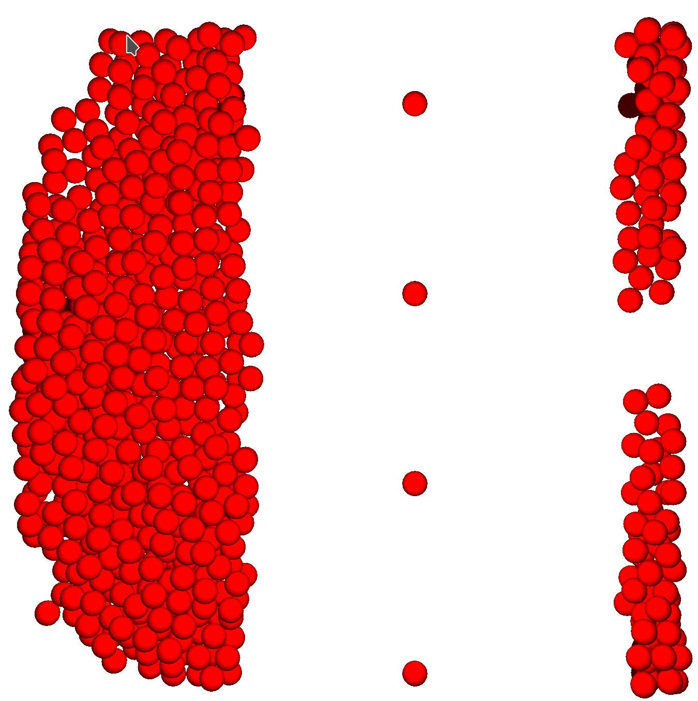
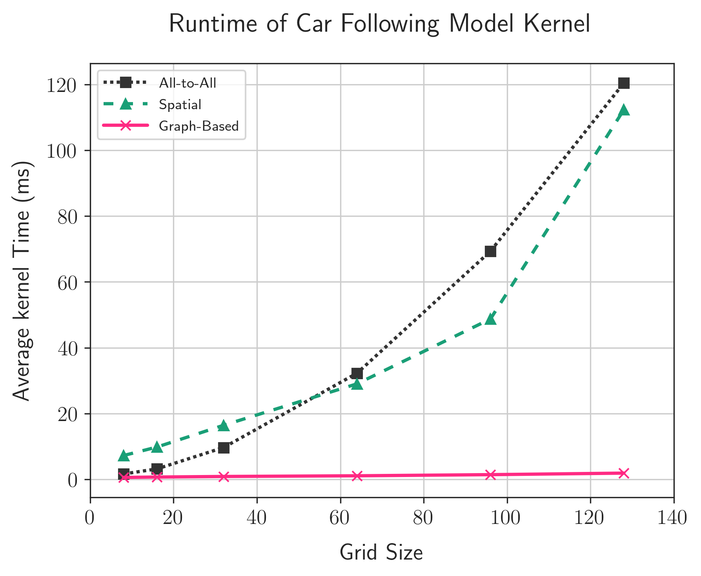
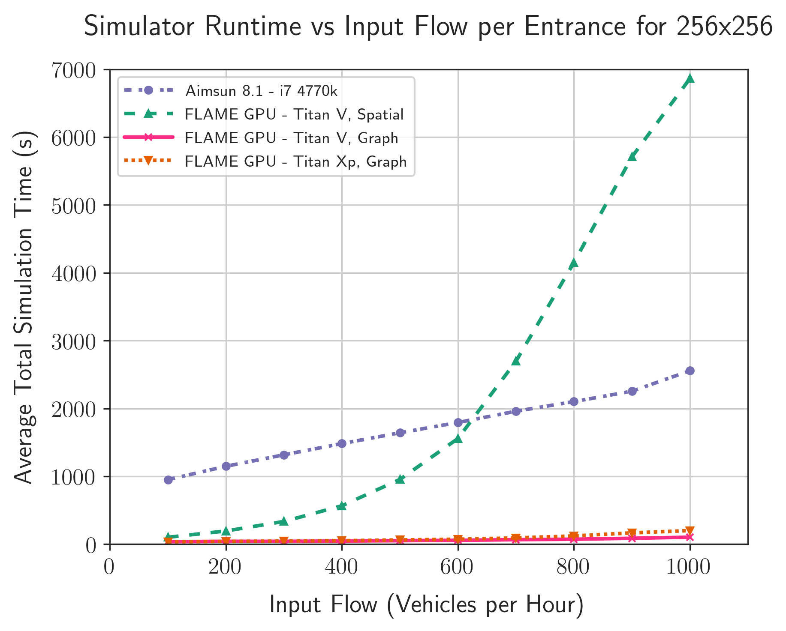

title: Large-Scale Road Network Simulations for Smart Cities
shorttitle: S9387 - Large-Scale Road Network Simulations for Smart Cities
mainauthor: Peter Heywood
otherauthors: Paul Richmond, Steve Maddock, Rob Chisholm & James Pyle
institute: The University of Sheffield
class: animation-fade
layout: true

.bottom-bar[
.col-8[
{{shorttitle}}
]
.pull-right[
{{mainauthor}}, {{institute}}
]
]

---

class: impact

# {{title}}
## {{mainauthor}},
### {{otherauthors}}
 
### {{institute}}

---

class: impact
# Smart City Simulation

+ Smart Cities
+ Transport Simulation
+ Computational Challenges

???

First I'm going to talk a little about Smart Cities, Transport Simulations and the Computational Challenges involved with smart city simulation

---

# Smart Cities

.col-6[    
+ Increasing traffic demand
    + 31% growth in UK motorway traffic by 2041 [1]

+ High congestion in cities
    + Travel speed reduced by 58% in London [2]
        + 15.6mph Peak
        + 36.9mph Free-flow

+ **Improve** utilisation and efficiency

+ **Reduce** congestion and pollution

+ Data-driven transport management

.citations[
[1] Highways England Strategic Road Network Initial Report December 2017

[2] Inrix 2018 Traffic Scorecard for London
]

]
.col-6.img-col[
.w-90[

]
]

???

We're all impacted by congestion on our road networks pretty much every day.

In part this is due to the increasing demand on our transport networks

For instance in the UK motorway demand is projected to increase by 31% by 2041, and the growth in demand doesn't just apply to our highways.

Our cities already struggle with congestion, especially at peak times. 

In London, the average travel speed is reduced by 58% during peak times, taking at least twice as long to reach our destinations as it should.

We can achieve this using *data driven management*

---

# Smart City Transport Simulation
.col-6[

+ Goals can be achieved through **simulation**
    + Planning
    + Management

+ Cities are challenging
    + High population density
    + Co-located modes
    + New modes of transport

+ Limitations on possible interventions
    + Space
    + Air Quality
    + Money

]
.col-6.img-col[

.caption[
[CC BY 2.0](http://creativecommons.org/licenses/by/2.0/)
Highways England 

[https://www.flickr.com/photos/highwaysagency/9950013283/](https://www.flickr.com/photos/highwaysagency/9950013283/)
]
]

???

We can meet these aims through better use of simulation, both when we are planning our road networks, and actively managing smart infrastructure.

**But** smart cities are difficult. 

Cities are dense, with a huge number of people in a relatively small space, using many modes of transport in shared spaces, including new technologies such as autonomous vehicles.

Cities also impose restrictions on the changes we can make. 

There isn't room to add new lanes or roads to increase capacity, 
We are becoming more aware of the negative impacts of pollution on our health, caused in part by our road networks
And making changes in the real world is incredibly expensive. 

---

# Transport Network Simulation Resolution
.col-7[
+ **Macroscopic** (Top-Down)
    + Simulate aggregate flows across links
    + *Low Resolution*
    + *Lowest Computational Cost*

+ **Mesoscopic**
    + Simulate platoons consisting of multiple vehicles

+ **Microscopic** (Bottom-up)
    + Simulate individual vehicles or people
    + *High Resolution*
    + *Very High Cost*
]
.col-5.img-col[
.w-78[

]
]

???

So when we use simulations to help design and run our road networks, we can do so at several resolutions. 

Traditionally, macro-scale simulations were the most prevalent. 
These are top-down, low-resolution simulations which are quite abstract from reality, treating our road networks as a series of pipes. 

We then have the mid-level mesoscopic simulations where we may consider platoons or groups of vehicles.

And finally the fine-grained microscopic simulations. High resolution bottom-up simulations where each individual in the system is modelled and simulated.

But these simulations have huge computational cost, but they can capture features which are not visible in higher resolution simulations, like the school rush.

---

# Agent Based Modelling (ABM)
.col-6[
+ An approach for Microsimulation

+ Individuals with properties
+ Simple rule-based behaviours
+ Interactions
    + Agent - Agent
    + Agent - Environment
+ Complex behaviours emerge

+ **Huge computational cost**
+ Large volumes of data required
+ Many simulations required
]
.col-6.img-col[
.w-90[

.caption[FLAME GPU Road Network Microscopic Simulation]
]
]

???

So I'm going to focus on Microscopic simulations which we are interested in, and one method for implementing Micro-scale simulations is to use Agent Based Modelling.

In Agent based models each individual, or agent, has its own properties. 

The modeller describes relatively simple behaviours, from the agents perspective,

with interactions between the agent and other agents, or the environment. 

These simple rules and interactions then allow more complex behaviours to emerge. You don't define the formation of queues at a stop sign, you simply define that a car generally won't crash into the car in front. 

But just to re-iterate, this is hugely expensive, and you need to run these simulations many many times. 

---

# Computational Challenges
.col-6[
+ Smart city simulations are **massively** computationally expensive

    + *Millions* of individuals
    + Multiple modes
    + Many permutations
        - Weather, Demand, etc.

+ Performance is limiting the use of simulation in industry [1]

+ **Faster simulators are required** 

.citations[
[1] Brackstone, M., & Punzo, V. (2014). Traffic Simulation: Case for guidelines. European Commission, Joint Research Centre, Luxembourg, 100.
]
]
.col-6.img-col[
.w-70[

.caption.even-smaller-caption[
[CC BY-SA 3.0](https://creativecommons.org/licenses/by-sa/3.0/)
[Rgoogin](https://en.wikipedia.org/wiki/User:Rgoogin) at the [English Wikipedia](https://en.wikipedia.org/wiki/)
]
]
]

???

You might have heard me say this already, but theses simulations are expensive. 

Urban environments can contain millions of individuals, 

across multiple modes of transport

and we need to run these simulations many many times to cover the broad range of conditions which may effect the environment and to take into account the stochastic nature of transport systems. 

What this means is that the performance of these simulations is limiting its use in the industry. 

So we need to make faster simulators. 

---

# Commercial Microsimulation tools

.col-5[
+ Many commercial and open-source simulators.
    + Aimsun
    + PTV Vissim
    + Parasim
    + SUMO
    + etc.

+ CPU-based simulators
    + Single-threaded
    + Multi-threaded

+ Poor scaling 
    + with additional processor cores
    + with problem size
]
.col-7.img-col[
.w-85[

.caption[
Aimsun 8.1 Microsimulation User Interface
]
]
]

???

Commercial and open source simulators are all currently CPU based. 

Tools such as Aimsun, Vissim and Parasim are multi-threaded CPU applications, but they suffer from poor scaling, 

Adn some simulators are only sequential in nature, such as SUMO which is the most prevalent open-source simulator. 

---

class: impact
# Our Aims

???

Now that we're all up to speed with the state of simulators for smart cities, I'm going to talk about what we have done.  

---

# Our Aims

.col-7.vcent-col[

.vcent[
+ Demonstrate GPU accelerated smart city simulations
    + Suitable for city-scale networks
    + Better-than-real-time performance

1. Implement subset of models from a commercial tool
2. Cross-validate GPU implementation
4. Benchmark using a scalable model
]
]
.col-5.img-col[
.w-100[

.caption[Nvidia Titan Xp and Titan V GPUs]
]
]

???

We wanted to show that GPUs are the **most appropriate tool** for smart city simulations. 

And that they are suitable for city-scale simulations and can do so better than real time, unlike the current state of the art CPU simulators. 

We chose to do this by implementing a subset of functionality from a commercial tool on the GPU, 

Cross validating the implementation to show it is doing the same thing

and run a range of benchmarks using a scalable model to evaluate performance. 

---

class: impact
# Microsimulation Benchmark

+ Reference Simulator
+ Scalable Artificial Transport Network
+ Reference Simulator Benchmarking

???

Now I'll talk about our reference model, the scalable network and some CPU benchmarking. 

---

# Reference CPU Simulator

.col-5.vcent-col[
+ Simulator to re-implement and compare
+ **Aimsun 8.1**
    + Multi-core CPU simulator
    + Used globally 
    + Suitable for a wide range of transport modelling tasks
    + Diminishing returns

.w-60[

.center[www.aimsun.com]
]
]
.col-7.img-col[
.w-90[

.caption[
Aimsun Performance using different numbers of CPU cores
]
]
]

???

Chose Aimsun as our reference CPU simulator

widely used in the UK 

and the developers were keen to collaborate to learn about GPUs

Aimsun is a multi-threaded simulator, which uses task-parlalelism and coarse-grained data parallelism

It's suitable for pretty much any road network you can think of,

But it suffers from diminishing returns from additional CPU cores. 

So on the right we can see the average runtime of a fixed size simulation using different CPUs and different thread counts, and we see diminishing returns from the additional CPU cores, with no improvement beyond 6 cores in an 8 core system. 

---

# Benchmark Microsimulation Models

.row[
.col-6[
+ Gipps' Car Following Model
+ Aimsun Gap Acceptance Model
+ Probability-based routing
]
.col-6[
+ Constant Vehicle Arrival
+ Stop-Sign Yellow-box junctions
+ Simulated Detectors
]
]

 
.row[
.col-12[
.w-90[

]
]
]

???

Not feasible for me to implement a fully featured microsimulator,

So we selected a subset of Aimsun's functionality to make a minimal representative simulator. 

We include the car following model, a Gap acceptance model for junctions, probabilistic routing and stop sign based junctions and simulated vehicle detectors.

---

# Benchmark Network

.col-4.vcent-col[
+ Manhattan-style grid network
+ Single lane, one-way roads
+ Stop-signs at junctions
+ Entrances and exits at the edges of the simulation
]
.col-8.img-col[
.w-99[

]
]

???

We wanted a benchmark road network which we could scale indefinately, 

We chose to use a simple Manhattan style grid.

made up of single lane, one-way roads terminated by a stop sign. 

Vehicles enter and exit at the edge of the simulation

In hindsight this is not ideal, as the environment and population scale at different rates. 

---

# Aimsun CPU Benchmarking

.col-5[
+ Aimsun 8.1
+ 4 core Intel i7 4770k CPU

+ 3 repetitions
+ 1 hour simulation 
+ Scaled environment and population

+ Largest Simulation
    + ~ 500,000 vehicles
    + ~ 2,000,000 detectors
    + 5447 seconds
    + **1.5x slower than real time**

+ **Too slow for real-time management**
]
.col-7.img-col[

]

???

We then benchmarked Aimsun 8.1 using this network at various scales, until it refused to scale any larger, on the 4 core i7 CPU under Windows. 

We ran 3 repetitions of a 1 hour simulation

and the largest simulation with a total vehicle demand of half a million vehicles and close to 2 million detectors completed in five and a half thousand seconds, around one and a half times slower than real time. 

This isn't ideal for managing road networks.

---

class: impact
# GPU Accelerated Microsimulation

+ FLAME GPU
+ Implementation Details
+ Cross Validation

???

Now we have some reference results, we can move onto our GPU accelerated simulator. 

---

# FLAME GPU

.col-7[

.smaller[
**F**lexible **L**arge-Scale **A**gent **M**odelling **E**nvironment for the **GPU**
]

+ High performance agent-based simulation
+ Template-based simulation environment
+ Agents modelled using X-Machines
    + *message lists* for communication
+ Abstracts CUDA complexities away from modeller
+ Used in many simulation domains

.center[
.w-37[

]

github.com/flamegpu/

**flamegpu.com**

]

]
.col-5.img-col[
.center.w-50[

]
.caption.smaller[
Keratinocyte Cell Simulation
]

.center.w-80[

]
.caption.smaller[
Pedestrian Simulation
]
]

???

We used the FLAME GPU framework to implement our ABM.

FLAME GPU is an open-source, high performance, general-purpose GPU accelerated agent based simulation framework.

Agents are modelled as a state machine, using message lists for agent communication. 

and we use XSLT-based code generate CUDA code for the modeller - they don't even need to know what a GPU is to use FLAME GPU. 

We've used it in a broad range of domains, from biological cellular simulations, to pedestrian simulations or more-abstract cellular automata.

---

# FLAME GPU Code Generation Process

.col-7.img-col[
.w-100[

]
]

.col-5.img-col[
.w-95[

]
]

???

When developing a FLAME GPU model, the user writes an XML file describing the state machine of the model, including the properties of each agent type and the messages used to communicate. 

A set of templates are used to generate CUDA code for the model, which is linked against  simple C functions also written by the modeller, which use the generated API to implement the individual behaviours.

XML files are then used to provide initial state information, and XML files can be output periodically showing the state of the simulation. 

---

# Why use FLAME GPU?

.col-6[
+ GPU knowledge not required

+ Divergence minimised 
    + State-based representation

+ Efficient memory access patterns
    + SoA, neighbouring threads
    + Appropriate use of memory hierarchy
        + Shared, Read-only etc.

+ Race conditions avoided
    + Message-lists
    + Natural synchronisation barriers

]
.col-6.img-col[
.w-100[

]
]

???

So why should a modeller use FLAME GPU, what are the advantages of doing so?

As I mentioned earlier, modellers don't need to know any CUDA to implement a model and access high levels of performance, for large scale simulations.

Because XSLT templates produce code which handles many of the complex parts of the CUDA model and data parallel programming for them. 

Divergence is minimised though the state based system used to describe the model. 

We leverage the GPUs memory hierarchy for locality.

And we avoid race conditions, both through double buffering and message lists. 

The state based system with message lists also provides natural synchronisation barriers, enabling the use of cuda streams for concurrency.

---

# Benchmark Microsimulation Models

.row[
.col-6[
+ Gipps' Car Following Model
+ Aimsun Gap Acceptance Model
+ Probability-based routing
]
.col-6[
+ Constant Vehicle Arrival
+ Stop-Sign Yellow-box junctions
+ Simulated Detectors
]
]

 
.row[
.col-12[
.w-90[

]
]
]

???

We then implemented these models using FLAME GPU, by describing the state machine and providing simple C code for each behaviour.

So for instance the car following model is implemented in one of the agent functions.

---

# Implementation State Diagram

.col-12.img-col[
.w-78[

]
]

???

This is the state diagram for our vehicle agents, modelling a single iteration of simulation.

I've ommited the detectors to try and keep this simple. 

So we have 3 possible states, shown by the circles

Queued vehicles are waiting to enter the simulation on an entrance edge, 

Road vehicle are traversing along the main sections of road, while junction vehicles are approaching or traversing a junction. 

Each black square is an agent function, while the green arrows and shapes indicate the message lists. 

For instance (describe the road state)

---

# Validation of GPU Implementation

.col-4[
+ Cross validated vs Aimsun 8.1
+ 6 sets of validation networks

+ Individual behaviours 
+ Combined effects
]
.col-8.img-col.responsive[
<video width="1920" height="1080" controls loop muted poster="video/ttrig-1080p30.png">
    <source src="video/ttrig-1080p30.webm" type="video/webm">
  Your browser does not support the video tag.
</video>

]

???

Once we had our implementation we cross validated using a set of networks designed to evaluate either individual behaviours, or the combined effects of multiple behaviours

And during debugging the real-time interactive visualisations which FLAME GPU provides were invaluable.

---

# Validation of GPU Implementation
.col-4[
+ Cross validated vs Aimsun 8.1
+ 6 sets of validation networks 

+ Individual behaviours 
+ Combined effects

+ Deterministic tests reproduced exactly
+ Stochastic test reproduced within acceptable range
]
.col-8.img-col[
.w-85[

.caption[Validation of Gipps' Car following model]
]
]

???

Our deterministic tests showed exactly matching results,

Whilst our aggregate stochastic tests fell within an acceptable range.

This is mainly due to the use of a different random number generator.

---

# Initial GPU Benchmarking

.col-4[
+ Benchmarked existing communication strategies

+ 1 hour simulation
+ 3 repetitions
+ Titan V

+ **Poor performance**

+ Agent Communication limits performance

]
.col-8.img-col[
.w-90[

]
]

???

So we ran our environment scale benchmarks, using our initial GPU implementation, and the performance was pretty grim.

So we need to improve performance.

---

class: impact

# Agent Communication

+ Existing Communication Strategies
+ Graph Based Communication
+ Application Benchmarking

???

To improve performance we need to understand agent communication within FLAME GPU models.

---

# FLAME GPU Communication

.row[
.col-6[

+ Message lists used to communicate
    + Avoids race conditions
    + Good cache utilisation 
    + Memory hierarchy optimisations
+ Message iteration often limits performance
+ Specialise communication pattern for efficiency

.w-65[

]
.caption[Boids Flocking Model - Spatial Partitioning]

]
.col-6[

+ Communication Patterns in FLAME GPU 1.4
    + All-to-All
    + Spatially Partitioned Messaging 
    + Discrete Partitioned Messaging

 

.w-49[

]
.caption[Game of Life - Discrete Partitioning]

]
]

???

Agents can output messages to these message list, which are then iterated by agents in subsequent functions. 

Iterating these message lists is usually the limit on performance of an agent function. One way to improve this is by reducing the number of messages each agent must read. 

In older versions of FLAME GPU  there were 3 communication strategies provided iby FLAME GPU.

 All to all communication, spatially partitioned messaging for local communication in continuous space, and discrete partitioned messaging for discrete space. 

For instance we use spatial partitioning for flocking models in continuous space, while discrete partitioned messaging improves the performance of cellular automata such as the game of life. 

---

# FLAME GPU Communication Benchmarking

.col-4[
+ Benchmarked existing communication strategies

+ 1 hour simulation
+ 3 repetitions
+ Titan V

+ Poor performance
+ **Majority of runtime spent iterating messages!**

+ Improve work-efficiency
]
.col-8.img-col[
.w-90[

]
]

???

We switched to spatially partitioned messaging with a sufficiently large communication radius and re-ran our benchmarks. 

This showed better performance than the default all-to-all communication

**but** the performance was still not great. Roughly comparable to the existing CPU code. 

Profiling showed that the majority of time was still spent iterating messages, and our kernels are memory bound. 

We need to further reduce the number of message lists being iterated, and improve work efficiency for the types of model used in road network simulations.

---

.col-5[
# Communication Example

### Gipps' Car Following Model
+ Agent only requires information from the lead vehicle to calculate new speed

+ I.e.  requires information from 

]
.col-7.right[

]

???

To illustrate this we're going to look at the car following model. 

Gipps' model essentially calculates the acceleration required to drive as close to the desired speed as possible, without crashing to the car in front. 

I.e. the orange vehicle only needs information from the purple vehicle, no one else matters. 

---

.col-5[
# Communication Example

### All-to-All Communication

+ Each agent reads every message

+ Agent  reads **42** messages
    + From   

.commtable[
| Communication Strategy | # Messages | 
|------------------------|------------|
| All-to-all             |         42 |
]
]
.col-7.right[

]

???

So using all to all communication,

where each agent reads the entire message list, 

the orange car will read all 42 messages 

---

.col-5[
# Communication Example

### Spatially Partitioned

+ Radius-based
+ Partition the environment
+ Read from Moore's Neighbourhood

+ Agent  reads **18** messages
    + From   

.commtable[
| Communication Strategy | # Messages | 
|------------------------|------------|
| All-to-all             |         42 |
| Spatial                |         18 |
]
]
.col-7.right[

]

???

We can reduce the number of messages read using spatial partitioning for continuous space. 

The environment is divided into a grid of cells, with the cell width equal to the communication radius. 

By reading the Moore's neighbourhood of cells, we are guaranteed to access all of the required messages, while maintaining a good memory access pattern. 

In this case, the orange agent now only reads 18 messages in the shaded area, 

in a more realistic, larger-scale example this would be a larger reduction. 

---

.col-5[
# Communication Example
### Graph Based

+ Couple messages to graph data structure
+ Read from relevant part of graph

+ Agent  reads **5** messages
    + From   

.commtable[
| Communication Strategy | # Messages | 
|------------------------|------------|
| All-to-all             |         42 |
| Spatial                |         18 |
| Graph                  |          5 |
]
]
.col-7.right[

]

???

But what if we could restrict the messages to be only those from the relevant part of the road network?

In this case, the orange agent would only read the 5 messages from the pink section of road. 

Again, in a larger example this would account for a significant improvement of work efficiency.

---

# Graph Based Communication Implementation

.row[
.col-6[

+ Compressed Sparse Row (CSR)

+ Embed *edge* or *vertex* index in message

+ Sort message list based on index
    + *Counting Sort*
    + Shared-memory atomics 
    + Builds histogram to access messages

+ Can access a single edge, or explore using CSR 

+ Neighbouring threads access same messages

+ Available from FLAME GPU 1.5.0

]
.col-6.img-col.responsive[
.w-90[

]
]
]

???

We implemented this in FLAME GPU 1.5,

We have a compressed sparse row representation of the road network for fast accesses.

and embed the index of the edge or vertex in the message

We sort the message list by the index, and construct a histogram to enable fast access to the relevant messages.

We do this with a counting-sort using shared-memory atomics, as the histogram is produced as a by-product of the sort.

---

# Graph Based Communication Performance

.col-4[
+ Measured performance of message input/output

+ Higher output cost 
    + ~0.5ms vs ~0.2ms

+ **Much lower** iteration cost
    + ~ 1ms vs ~ 120ms

+ Improved work efficiency
+ Huge reduction in global memory accesses

]
.col-8.img-col[.w-88[

]]

???

So we timed the car following model kernel at some of the lower benchmark scales, 

and we see a huge reduction in the kernel runtime

Although this does come with increased cost when outputting messages and sorting the message list. 

---

# Graph-based Communication Benchmarking

.col-4[
+ Benchmarked graph-based communication

+ 1 hour simulations
+ 3 repetitions

+ Titan V

+ **Significant performance improvement!**
]
.col-8.img-col[
.w-90[

]
]

???

So if we re-run our network-scale benchmarks on the Titan V, 

we see a huge performance improvement as shown by the new pink line on the figure. 

---

# Graph-based Communication Benchmarking

.col-4[
+ Benchmarked graph-based communication

+ 1 hour simulations
+ 3 repetitions

+ Titan V
+ 0.5 million vehicles
    + 82.04 seconds
    + **66x faster than CPU**
    + **44x faster than real-time**
    + 1.9x faster than Titan Xp

]
.col-8.img-col[
.w-90[

]
]

???

Here we have the same CPU and Titan V  graph based communication results

dismissed the all to all and spatially partitioned results 

and included Pascal with results from P100 and a Titan Xp. 

For the 1 hour simulation of half a million vehicles, a Titan V ran the simulation in 82 seconds.

This is 66 times faster than the 4 core CPU, and more importantly 44 times better than real time - which is great and what we wanted to see.

We could also run larger simulations than the CPU, although we didn't push this much further.

---

# Run-time per Simulation Iteration
.col-7.img-col[
.w-100[

]
]

.col-5[
+ Timed individual iterations
+ 256 x 256 grid
    + Up-to 256,000 vehicles

+ i7 4770k 
+ Titan X (Pascal)

+ Runtime increases as population grows
+ Anomalous Values from periodic detector behaviour
]

???

We can look at other aspects of the performance of our simulator.

Looking at the run time of each iteration for a specific simulation, we can see that our GPU iterations are much quicker than CPU iterations. 

As the simulation progresses, the number of vehicles within the simulation increases, along with the runtime. 

We do have some outliers, which correspond to periodic behaviour of the vehicle detectors, which occurs every 10 minutes, or 750 iterations.

---

# Input Flow Benchmarking: 64x64 grid

.col-7.img-col[
.w-100[

]
]
.col-5[
+ Varied input flow of vehicles per edge
    + I.e. vehicle density
+ 64 x 64 grid

+ Spatially Partitioned Messaging
    + Low:  **1.5x** faster than CPU
    + High: **2.6x** slower than CPU

+ Graph Partitioned Messaging
    + Up to **6.6x** faster than CPU
    + Up to **17.0x** faster than SPM

    
+ Titan V up to **5%** faster than Titan Xp

]

???

We also performed benchmarks where we scaled the population size for fixed size networks by varying input flow. 

Here we have the CPU results, the Titan V with spatially partitioned messaging, and graph based communication for the Titan V and Titan Xp. 

At this relatively small scale simulation we see that graph messaging GPU is always better than the cpu

while the spatially partitioned messaging is only better than the CPU up to around 400 vehicles per hour per entrance - once messages lists grow too large.

---

# Input Flow Benchmarking: 256x256 grid 

.col-7.img-col[
.w-100[

]
]
.col-5[
+ Varied input flow of vehicles per edge
    + I.e. vehicle density
+ 256 x 256 grid

+ Spatially Partitioned Messaging
    + Low: **9.3x** faster than CPU
    + High: **2.7x** slower than CPU

+ Graph Partitioned Messaging
    + Up to **24.7x** faster than CPU
    + Up to **66.3x** faster than SPM

    
+ Titan V up to **94%** faster than Titan Xp
]

???

The same can be said for this larger scale network, but the point at which the spatially partitioned messaging performs worse than the CPU requires a higher input flow, in vehicles per hour per entrance.

We also see that at this scale the larger core count and memory bandwidth from the Volta GPU offers a performance improvement over the older Pascal GPU. 
---

class: impact 
# Other Work

+ Additional Functionality
+ Multi-Mode GPU Simulations
+ Machine Learning Surrogate Models
+ FLAME GPU 2

???

So we've shown how we can make our GPU road network simulations fast enough for city scale simulation, but we can't stop there. 

I'm going to very briefly mention some of the future and related work we are doing.

---

# Additional Functionality
.col-6[
+ Real world simulation requires additional functionality
    + Multi-lane roads
    + Dynamic infrastructure
    + O-D Routing
    + Gather additional statistics

+ Room for further performance improvements
    + Reduce load on global memory
    + Improve use of CUDA streams
    + Will be implemented in future versions of FLAME GPU 

]
.col-6.img-col[
.w-90[

.caption.even-smaller-caption[
M24 motorway at night - Bob McCaffrey

[CC BY-SA 2.0](https://creativecommons.org/licenses/by-sa/2.0/)

[https://www.flickr.com/photos/mccaffrey_uk/3207277407](https://www.flickr.com/photos/mccaffrey_uk/3207277407)
]
]
]

???

So first of all our simulator is not ready for the real world. 

Now that we have a proof of concept we need to implement the missing functionality which will enable us to simulate real world road networks, 

There is also still room for further performance optimisation. 

Although we have reduced the load on global memory by improving work efficiency, most of our kernels are still memory bound.

This is partially due to the low arithmetic intensity found in road network models, but also due to some design decisions in FLAME GPU to increase accessibility to the user, which were not really an issue in other simulation domains. 

We can also improve concurrency within the model, by both redesigning our state diagram and improving the use of CUDA streams within FLAME GPU. 

---

# Multi-Mode Simulation: Cars & Pedestrians

.col-4.vcent-col[
+ Simulate pedestrians and vehicles on GPU
+ Urban shared spaces
+ Social-force pedestrian simulations included in FLAME GPU examples
+ Real-time simulations of 100,000s of pedestrians
]
.col-8[
.img-col.responsive.inner-margin-top[
<video width="1920" height="1080" controls loop muted poster="video/ped-london-1080p25.png">
    <source src="video/ped-london-1080p25.webm" type="video/webm">
  Your browser does not support the video tag.
</video>

]

]

???

We also need to work on Multi-mode simulations on the GPU. 

Previously we have used FLAME GPU for pedestrian simulations to great effect, but we haven't yet combined our pedestrian and road network simulations, for shared space modelling. 

---

# Multi-Mode Simulation: Cars, Pedestrians & Rail

.col-6.vcent-col[
+ SIEMENS Sheffield Advanced Multi-Model Simulator
+ Multi-modal Smart-City Simulation
    + GPU accelerated pedestrian simulator
    + CPU rail simulator
    + CPU road network simulator (SUMO)
+ Evaluate rail network performance 
    + including pedestrian behaviours in station 

+ More information: [youtu.be/Rz_XzbZIMes](https://youtu.be/Rz_XzbZIMes)

+ **Robert Chisholm** [r.chisholm@sheffield.ac.uk](mailto:r.chisholm@sheffield.ac.uk)
+ **Paul Richmond** [p.richmond@sheffield.ac.uk](mailto:p.richmond@sheffield.ac.uk)
]
.col-6.responsive[
<video width="1920" height="2160" controls loop muted poster="video/S2AM.png">
    <source src="video/S2AM.webm" type="video/webm">
  Your browser does not support the video tag.
</video>

]

???

And we can take this even further to include other modes such as rail. 

Working with Siemens, my colleges Robert Chisholm and Paul Richmond produced a multi mode simulator combining a GPU pedestrian simulation with a rail simulation and CPU based road network simulation.

This allows the impact of pedestrian behaviour on the rail network schedule to be assessed. 

So in the short clip we have a low pedestrian demand and high pedestrian demand situation. We can see that the high train is delayed in the busier case due to the pedestrian behaviour, which then has a cascade effect on the rail network.

---

# Surrogate Transport Network Models

.col-7[
.smaller[
+ Machine Learning inference faster than simulation
+ But Networks biased towards training data
    + **Low accuracy for low-frequency events**

1. **Supplement training data with simulated data**
    + Improving accuracy for low-frequency events
2. **Surrogate models**
    + (Deep) Neural Networks to predict simulator output
    + Accelerates parameter search
        + Calibration & Validation
        + Optimisation

+ Generate huge amounts of training data using GPU accelerated simulations

+ **James Pyle** [jcbpyle1@sheffield.ac.uk](mailto:jcbpyle1@sheffield.ac.uk)
+ **Paul Richmond** [p.richmond@sheffield.ac.uk](mailto:p.richmond@sheffield.ac.uk)
]
]
.col-5.img-col[
.w-66[
    
]
.w-100[

.caption.even-smaller-caption[
[CC BY-SA 3.0](https://creativecommons.org/licenses/by-sa/3.0/)
[https://commons.wikimedia.org/wiki/File:MultiLayerNeuralNetworkBigger_english.png](https://commons.wikimedia.org/wiki/File:MultiLayerNeuralNetworkBigger_english.png)
]
]
]

???

And another PhD student James Pyle is looking at the use of surrogate models for complex systems predictions. 

He's investigating the supplementation real-world training data with simulated data, for low-frequency events to produce better prediction networks. 

He's also using Deep Learning to predict the outcome of complex system simulations, This could be used for quickly targeting global optimisation candidates, narrowing the parameter search space. 

And also 

---

# FLAME GPU 2

.col-6[
+ *Under Active Development*

+ Ground-up rewrite
+ Modern C++/CUDA
+ Improved:
    + Performance
    + Usability
    + Maintainable

]
.col-6[
+ New functionality (planned)
    + Automatic parameter exploration
    + Concurrent batch simulation
    + Multi-GPU support & UVM
    + Higher-level language bindings
        + I.e. Python

**[github.com/flamegpu/flamegpu2_dev](https://github.com/flamegpu/flamegpu2_dev)**

]
.col-12.center[
.w-40[

]

]
 
???

And finally we are actively working on a new major version of FLAME GPU. 

This is going to be a complete re-write using modern C++ rather than XSLT templating. 

This should make it much simpler for us to develop and maintain the code, whilst improving usability and enabling us to make performance improvements.

We're also planning on adding a range of new features to improve quality of life.

---

class: impact

# Conclusions

---

# Conclusion

.col-6[

+ **Faster-than-real-time city-scale microsimulation**

+ Simulation of 500,000 vehicles
    + **44x faster than real-time**
    + **66x faster than Aimsun 8.1 (CPU)**

+ Achieved using FLAME GPU
    + New graph-based agent communication strategy
    + Cross-validated implementation
    + FLAME GPU 2 is under development
]
.col-6.img-col[
.w-90[

]
]

???

So finally, to conclude, 

We have demonstrated that GPUs can enable faster than real time, city scale microsimulations. 

Our FLAME GPU based simulator was capable of simulating 1/2 million vehicles 44x faster than real time, and 66x faster than a well-optimised CPU simulator. 

---

class:thankyou

# Thank You

.smaller[
.col-5[
+ Peter Heywood
    + p.heywood@sheffield.ac.uk
    + [ptheywood.uk](https://ptheywood.uk)

+ Co-authors:
    + p.richmond@sheffield.ac.uk
    + s.maddock@sheffield.ac.uk
    + r.chisholm@sheffield.ac.uk
    + jcbpyle1@sheffield.ac.uk

.highlightbox[
+ **Sheffield GPU Hackathon 2019**
    + 19th-23rd August 2019
    + Sheffield, United Kingdom
    + **[http://gpuhack.shef.ac.uk](http://gpuhack.shef.ac.uk)**

]
.tr-uni-logo[

]

]
.col-7[
.w-90-left[
#### Supported by
+ EPSRC fellowship “Accelerating Scientific Discovery with Accelerated Computing” (EP/N018869/1)
+ DfT Transport Technology Research Innovation Grant (T-TRIG July 2016)

 

#### More Information

*"Data-parallel agent-based microscopic road network simulation using graphics processing units"* 
    
Peter Heywood, Steve Maddock, Jordi Casas, David Garcia, Mark Brackstone & Paul Richmond. 2017 

[doi.org/10.1016/j.simpat.2017.11.002](https://doi.org/10.1016/j.simpat.2017.11.002)
]
]
]

???

Thank you for listening, and now I think we have time for some questions. 
