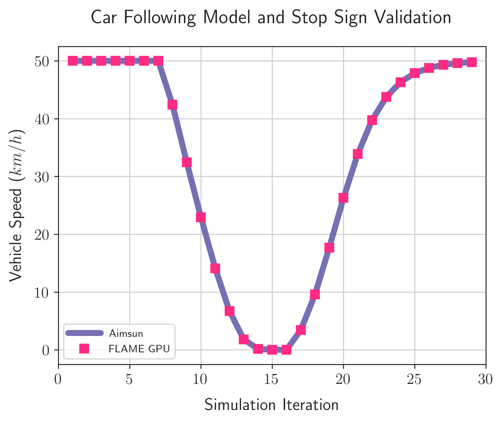
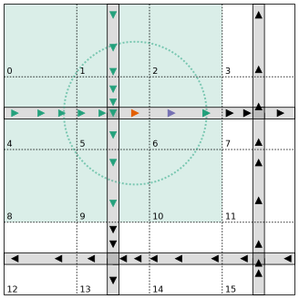
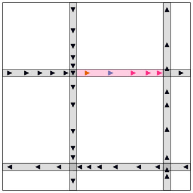
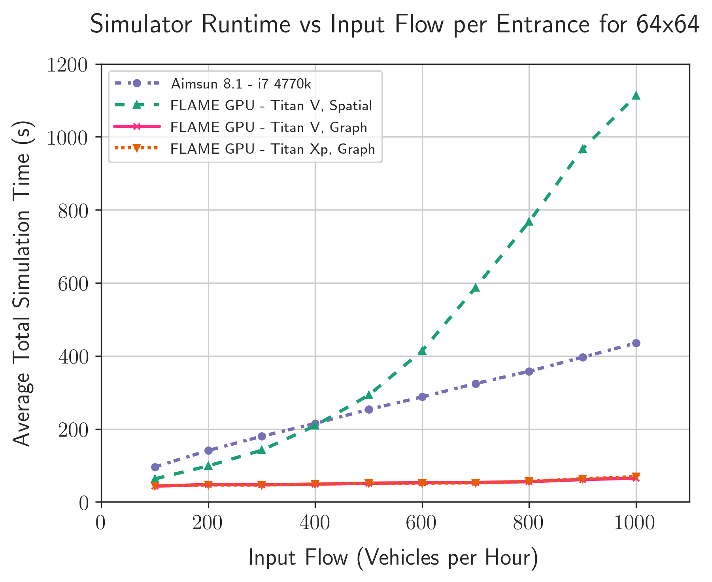

title: Large-Scale Road Network Simulations for Smart Cities
shorttitle: S9387 - Large-Scale Road Network Simulations for Smart Cities
mainauthor: Peter Heywood
otherauthors: Paul Richmond, Steve Maddock, Rob Chisholm & James Pyle
institute: The University of Sheffield
class: animation-fade
layout: true

.bottom-bar[
.col-8[
{{shorttitle}}
]
.pull-right[
{{mainauthor}}, {{institute}}
]
]

---

class: impact

# {{title}}
## {{mainauthor}},
### {{otherauthors}}
 
### {{institute}}

---

class: impact
# Smart City Simulation

+ Smart Cities
+ Transport Simulation
+ Computational Challenges

???

First I'm going to talk a little about Smart Cities, Transport Simulations and the Computational Challenges involved with smart city simulation

---

# Smart Cities

.col-6[    
+ Increasing traffic demand
    + 31% growth in UK motorway traffic by 2041 [1]

+ High congestion in cities
    + Travel speed reduced by 58% in London [2]
        + 15.6mph Peak
        + 36.9mph Free-flow

+ **Improve** utilisation and efficiency

+ **Reduce** congestion and pollution

+ Data-driven transport management

.citations[
[1] Highways England Strategic Road Network Initial Report December 2017

[2] Inrix 2018 Traffic Scorecard for London
]

]
.col-6.img-col[
.w-90[

]
]

???

I'm Sure that all of us here have been delayed by congestion recently. 

For instance on Sunday traveling back from Santa Cruz on Highway 17 I was stuck in a queue which added 45 minutes to the journey, and I almost missed the welcome reception. 

Although this was caused by a collision, a lot of delays are due to the increasing number of vehicles on our road networks,

Which is projected to continue to grow, by upto 31% in the UK by 2041. 

We also know that our cities are congested. We have statistics for London showing that the travel speeds are reduced by over 50% on average during peak hours. And Peak hours are widening. 

To resolve these issues we need to increase the utilisation and efficiency of our transport networks, 

to reduce congestion and pollution.

We can achieve this using *data driven management*

---

# Smart City Transport Simulation
.col-6[

+ Goals can be achieved through **simulation**
    + Planning
    + Management

+ Cities are challenging
    + High population density
    + Co-located modes
    + New modes of transport

+ Limitations on possible interventions
    + Space
    + Air Quality
    + Money

]
.col-6.img-col[

.caption[
[CC BY 2.0](http://creativecommons.org/licenses/by/2.0/)
Highways England 

[https://www.flickr.com/photos/highwaysagency/9950013283/](https://www.flickr.com/photos/highwaysagency/9950013283/)
]
]

???

We can achieve these goals through better use of road network simulations, during both planning of infrastructure and management of infrastructure

But Cities are more challenging to accurately simulate than non-urban environments. 

There are more people in less space, many modes of transport in shared spaces, and new modes emerging such as CAVs. 

Cities also restrict the possible solutions. There is no space to increase capacity by widening roads, Air Quality must be improved for public health and real world interventions can be incredibly expensive. 

---

# Transport Network Simulation Resolution
.col-7[
+ **Macroscopic** (Top-Down)
    + Simulate aggregate flows across links
    + *Low Resolution*
    + *Lowest Computational Cost*

+ **Mesoscopic**
    + Simulate platoons consisting of multiple vehicles

+ **Microscopic** (Bottom-up)
    + Simulate individual vehicles or people
    + *High Resolution*
    + *Very High Cost*
]
.col-5.img-col[
.w-78[

]
]

???

When we're simulating our transport networks, we can do so at different resolutions. 

Traditionally Macroscopic simulations are the most prevalent. These are top down simulations which model transport at a high, quite abstract level. Such as fluids moving along pipes. These Low resolution simulations have a relatively low computational cost. 

We then have the lower-level mesoscopic simulations where we may consider platoons of vehicles.

And finally the fine-grained microscopic simulations, where each individual in the system is modelled and simulated.

Micro scale simulations have huge computational cost, but they capture fine-grained interactions and emergent behaviours which may be overlooked by lower resolution approaches. 

I'm going to focus on Microsimulations. 

---

# Agent Based Modelling (ABM)
.col-6[
+ An approach for Microsimulation

+ Individuals with properties
+ Simple rule-based behaviours
+ Interactions
    + Agent - Agent
    + Agent - Environment
+ Complex behaviours emerge

+ **Huge computational cost**
+ Large volumes of data required
+ Many simulations required
]
.col-6.img-col[
.w-90[

.caption[FLAME GPU Road Network Microscopic Simulation]
]
]

???

One approach for modelling microscopic models is Agent Based Modelling.

In Agent based models each individual, or agent has its own properties. The modeller describes relatively simple behaviours for each agent which includes interactions between agents and between agents and the environment. 

More complex behaviours then emerge from these simple behaviours.

---

# Computational Challenges
.col-6[
+ Smart city simulations are **massively** computationally expensive

    + *Millions* of individuals
    + Multiple modes
    + Many permutations
        - Weather, Demand, etc.

+ Performance is limiting the use of simulation in industry [1]

+ **Faster simulators are required** 

.citations[
[1] Brackstone, M., & Punzo, V. (2014). Traffic Simulation: Case for guidelines. European Commission, Joint Research Centre, Luxembourg, 100.
]
]
.col-6.img-col[
.w-70[

.caption.even-smaller-caption[
[CC BY-SA 3.0](https://creativecommons.org/licenses/by-sa/3.0/)
[Rgoogin](https://en.wikipedia.org/wiki/User:Rgoogin) at the [English Wikipedia](https://en.wikipedia.org/wiki/)
]
]
]

???

Unfortunately smart city microsimulations have massive computational cost. 

Urban environments can contain millions of individuals, 

across multiple modes of transport

and we need to run these simulations many many times to cover the broad range of conditions which may effect the environment and to take into account the stochastic nature of transport systems. 

But ultimately the performance of microsimulations is limiting its use in the industry, as the simulations can take such a long time. 

There is a need to improve the performance of these simulators. 

---

# Commercial Microsimulation tools

.col-5[
+ Many commercial and open-source simulators.
    + Aimsun
    + PTV Vissim
    + Parasim
    + SUMO
    + etc.

+ CPU-based simulators
    + Single-threaded
    + Multi-threaded

+ Poor scaling 
    + with additional processor cores
    + with problem size
]
.col-7.img-col[
.w-85[

.caption[
Aimsun 8.1 Microsimulation User Interface
]
]
]

???

Now I'm not saying that the many commercial and open source tools don't care about performance, but they may not be using the most appropriate hardware for the job. 

Tools such as Aimsun, Vissim and Parasim are multi-threaded CPU applications, but they see poor performance scaling from additional processor cores and with the scale of problem. 

Some simulators are only sequential in nature, such as the open source SUMO. 

---

class: impact
# Our Aims

???

Now that we're all up to speed with the state of simulators for smart cities, I'm going to talk about what we have done.  

---

# Our Aims

.col-7.vcent-col[

.vcent[
+ Demonstrate GPU accelerated smart city simulations
    + Suitable for city-scale networks
    + Better-than-real-time performance

1. Implement subset of models from a commercial tool
2. Cross-validate GPU implementation
4. Benchmark using a scalable model
]
]
.col-5.img-col[
.w-100[

.caption[Nvidia Titan Xp and Titan V GPUs]
]
]

???

We wanted to show that GPUs are the appropriate tool for smart city simulations. 

Showing that they are suitable for city-scale networks and can do so better than real time, unlike the current state of the art CPU simulators. 

We did this by implementing a subset of functionality from a commercial tool on the GPU, 

Cross validating the implementation to show it is doing the same thing

and benchmark both implementations using a model we could scale indefinitely. 

---

class: impact
# Microsimulation Benchmark

+ Reference Simulator
+ Scalable Artificial Transport Network
+ Reference Simulator Benchmarking

???

Now I'll talk about our reference model, the scalable network and some CPU benchmarking. 

---

# Reference CPU Simulator

.col-5.vcent-col[
+ Simulator to re-implement and compare
+ **Aimsun 8.1**
    + Multi-core CPU simulator
    + Used globally 
    + Suitable for a wide range of transport modelling tasks
    + Diminishing returns

.w-60[

.center[www.aimsun.com]
]
]
.col-7.img-col[
.w-90[

.caption[
Aimsun Performance using different numbers of CPU cores
]
]
]

???

We chose Aimsun as our reference CPU simulator, as it is widely used in the UK and the developers were keen to find out if they could benefit from GPUs, and how to do so. 

Aimsun is a multi-core CPU simulator, which uses coarse-grained data parallelism and task-parallelism to improve performance. 

It can simulate pretty much any road network you can think of, and is used globally. 

The figure on the right shows the runtime of a fixed size simulation as we increase the number of processing cores. As you can see there is no improvement from going above 6 processing cores, and this is a common trend across CPU architectures. 

---

# Benchmark Microsimulation Models

.row[
.col-6[
+ Gipps' Car Following Model
+ Aimsun Gap Acceptance Model
+ Probability-based routing
]
.col-6[
+ Constant Vehicle Arrival
+ Stop-Sign Yellow-box junctions
+ Simulated Detectors
]
]

 
.row[
.col-12[
.w-90[

]
]
]

???

It wasn't feasible for us to re-implement the full simulator, to determine if GPUs are valuable or not, so we selected a subset of models and functionality to produce a minimal simulator that will be representative of performance. 

This includes a the Gipps car following model, a Gap acceptance model for junctions, probabilistic routing and stop sign based junctions. 

---

# Benchmark Network

.col-4.vcent-col[
+ Manhattan-style grid network
+ Single lane, one-way roads
+ Stop-signs at junctions
+ Entrances and exits at the edges of the simulation
]
.col-8.img-col[
.w-99[

]
]

???

We chose to use a simple Manhattan style grid network as it is simple to scale.

Using single lane, one-way roads terminated by a stop sign. 

Vehicles enter and exit at the edge of the simulation

In hindsight this is not ideal, as the environment and population scale at different rates. 

---

# Aimsun CPU Benchmarking

.col-5[
+ Aimsun 8.1
+ 4 core Intel i7 4770k CPU

+ 3 repetitions
+ 1 hour simulation 
+ Scaled environment and population

+ Largest Simulation
    + ~ 500,000 vehicles
    + ~ 2,000,000 detectors
    + 5447 seconds
    + **1.5x slower than real time**

+ **Too slow for real-time management**
]
.col-7.img-col[

]

???

We then benchmarked Aimsun 8.1 using this network at various scales, until it refused to scale any larger, on the 4 core CPU I had available at the time. 

We ran 3 repetitions of a 1 hour simulation

and the largest simulation with a total vehicle demand of half a million vehilcles and close to 2 million detectors completed in five and a half thousand seconds, around one and a half times slower than real time. 

This isn't ideal for managing road networks.

---

class: impact
# GPU Accelerated Microsimulation

+ FLAME GPU
+ Implementation Details
+ Cross Validation

???

Now we have our reference benchmark results, we can move onto our GPU accelerated simulator. 

I'm going to talk a little about the ABM framework we used, provide some details of our implementation and of our cross validation. 

---

# FLAME GPU

.col-7[

.smaller[
**F**lexible **L**arge-Scale **A**gent **M**odelling **E**nvironment for the **GPU**
]

+ High performance agent-based simulation
+ Template-based simulation environment
+ Agents modelled using X-Machines
    + *message lists* for communication
+ Abstracts CUDA complexities away from modeller
+ Used in many simulation domains

.center[
.w-37[

]

github.com/flamegpu/

**flamegpu.com**

]

]
.col-5.img-col[
.center.w-50[

]
.caption.smaller[
Keratinocyte Cell Simulation
]

.center.w-80[

]
.caption.smaller[
Pedestrian Simulation
]
]

???

We used the FLAME GPU framework to implement our ABMs, which at the time was the only GPU accelerated general purpose agent based modelling framework.

FLAME GPU is a high performance agent based simulator, using XSLT based code generation. 

Agents are modelled as a state machine, with message lists for communication. 

This means that the development of a model doesn't require any explicit GPU knowledge. 

FLAME GPU has been previously used in a broad range of simulation domains. 

such as cellular simulations of tissue healing at the top, and pedestrian simualtions below.  

---

# FLAME GPU Code Generation Process

.col-7.img-col[
.w-100[

]
]

.col-5.img-col[
.w-95[

]
]

???

When developing a FLAME GPU model, the user writes an XML file describing the state machine of the model, including the properties of each agent type and the messages used to communicate. 

A set of templates are used to generate CUDA code for the model, which is linked against  simple C functions also written by the modeller, which use the generated API to implement the individual behaviours.

XML files are then used to provide initial state information, and XML files cna be output periodically showing the state of the simualation. 

---

# Why use FLAME GPU?

.col-6[
+ GPU knowledge not required

+ Divergence minimised 
    + State-based representation

+ Efficient memory access patterns
    + SoA, neighbouring threads
    + Appropriate use of memory hierarchy
        + Shared, Read-only etc.

+ Race conditions avoided
    + Message-lists
    + Natural synchronisation barriers

]
.col-6.img-col[
.w-100[

]
]

???

As I mentioned earlier, modellers don't need to know any CUDA to implement a model and access high levels of performance.

The XSLT templates produce code which handles many of the complex parts of the CUDA model and data parallel programming for them. 

Divergence is minimised though the state based system used to describe the model. 

We leverage the memory heirarcy of the GPU to ensure high performance and good memory access patterns

And thanks to the use of message lists and double buffering we completely avoid race conditions.

The state based system with message lists also provides natural synchronisation barriers, enabling the use of cuda streams for concurrency.

---

# Benchmark Microsimulation Models

.row[
.col-6[
+ Gipps' Car Following Model
+ Aimsun Gap Acceptance Model
+ Probability-based routing
]
.col-6[
+ Constant Vehicle Arrival
+ Stop-Sign Yellow-box junctions
+ Simulated Detectors
]
]

 
.row[
.col-12[
.w-90[

]
]
]

???

We then implemented these models using FLAME GPU, by describing the state machine and providing simple C code for each behaviour.

---

# Implementation State Diagram

.col-12.img-col[
.w-78[

]
]

???

This is the state diagram for our vehicle agents, modelling a single iteration of simulation.

I've ommited the detectors to try and keep this simple. 

So we have 3 possible states, represented by the circle:

Queued vehicles are waiting to enter the simulation on an entrance edge, 

Road vehicle are traversing along the main sections of road, while junction vehicles are approaching or traversing a junction. 

Each black square is an agent function, while the green arrows and shapes indicate the message lists. 

For instance (describe the road state)

---

# Validation of GPU Implementation

.col-4[
+ Cross validated vs Aimsun 8.1
+ 6 sets of validation networks

+ Individual behaviours 
+ Combined effects
]
.col-8.img-col.responsive[
<video width="1920" height="1080" controls loop muted poster="video/ttrig-1080p30.png">
    <source src="video/ttrig-1080p30.webm" type="video/webm">
  Your browser does not support the video tag.
</video>

]

???

We cross validated the implementation using a set of 6 validation networks

Targetting individual behaviours and combined effects of multiple behaviours.

The real time visualisation was also incredibly useful during development.

---

# Validation of GPU Implementation
.col-4[
+ Cross validated vs Aimsun 8.1
+ 6 sets of validation networks 

+ Individual behaviours 
+ Combined effects

+ Deterministic tests reproduced exactly
+ Stochastic test reproduced within acceptable range
]
.col-8.img-col[
.w-85[

.caption[Validation of Gipps' Car following model]
]
]

???

The tests which were designed to be deterministic reproduced exactly. Ie. the stop sign validation shown on the right. 

Whilst stochastic tests showed different results per individual run, due to different random number generation, but aggregate results were within acceptable ranges. 

---
class: impact

# Agent Communication

+ Existing Communication Strategies
+ Graph Based Communication
+ Application Benchmarking

???

At this point we have a working implementation, but with FLAME GPU models the communication between agents can have a massive impact on performance. 

---

# FLAME GPU Communication

.row[
.col-6[

+ Message lists used to communicate
    + Avoids race conditions
    + Good cache utilisation 
    + Memory hierarchy optimisations
+ Message iteration often limits performance
+ Specialise communication pattern for efficiency

.w-65[

]
.caption[Boids Flocking Model - Spatial Partitioning]

]
.col-6[

+ Communication Patterns in FLAME GPU 1.4
    + All-to-All
    + Spatially Partitioned Messaging 
    + Discrete Partitioned Messaging

 

.w-49[

]
.caption[Game of Life - Discrete Partitioning]

]
]

???

As I've mentioned in FLAME GPU message lists are used to communicate. 

Messages are stored separate to agent data, to avoid race conditions and allow memory access patterns to be optimised.

Iterating these message lists is usually the limit on performance of an agent function. One way to improve this is by reducing the number of messages each agent must read. 

Previously there were 3 methods provided in FLAME GPU. All to all communciation, spatially partitioned messaging to restrict messages to the local neighbourhood, and discrete partitioned messaging for cellular automata. 

For instance we use spatial partitioning the improve the performance of flocking models in continuous space, while discrete partitioned messaging improves the performance of cellular automata style models such as the game of life. 

---

# FLAME GPU Communication Benchmarking

.col-4[
+ Benchmarked existing communication strategies

+ 1 hour simulation
+ 3 repetitions
+ Titan V

+ Poor performance
+ **Majority of runtime spent iterating messages!**

+ Improve work-efficiency
]
.col-8.img-col[
.w-90[

]
]

???

If we benchmark our road network model using the communication strategies, we don't see great results.

Using all to all communication our GPU implementation is always slower than a 4 core CPU, while using spatial partitioning we see a minor speedup compared to the CPU in the middle of the scale range. 

Through profiling we know that most of the runtime is spent in the message iteration loops and our kernels are very much memory bound, so we need to improve work efficiency and read fewer messages per agent. 

---

.col-5[
# Communication Example

### Gipps' Car Following Model
+ Agent only requires information from the lead vehicle to calculate new speed

+ I.e.  requires information from 

]
.col-7.right[

]

???

To illustrate this we're going to look at the car following model. 

Gipps' model essentially calculates the acceleration required to drive as close to the desired speed as possible, without crashing to the car in front. 

I.e. the orange vehicle only needs information from the purple vehicle. 

Other models such as any lange changing model or junction models need similar information, from lead / trailing vehicles or those approaching a junction. I.e local proximity within the road network. 

---

.col-5[
# Communication Example

### All-to-All Communication

+ Each agent reads every message

+ Agent  reads **42** messages
    + From   

.commtable[
| Communication Strategy | # Messages | 
|------------------------|------------|
| All-to-all             |         42 |
]
]
.col-7.right[

]

???

So in this example, using all to all messaging

where each agent reads the entire message list, the orange car will read all 42 messages. 

---

.col-5[
# Communication Example

### Spatially Partitioned

+ Radius-based
+ Partition the environment
+ Read from Moore's Neighbourhood

+ Agent  reads **18** messages
    + From   

.commtable[
| Communication Strategy | # Messages | 
|------------------------|------------|
| All-to-all             |         42 |
| Spatial                |         18 |
]
]
.col-7.right[

]

???

We can reduce the number of messages read using spatial partitioning. 

In spatial partitioning the environment is divided into a grid of cells. The width of each cell is set to the radius of communication, which means that by reading the messages from the moores neighbourhood of cells all messages within the radius will have been parsed

along with some extras. 

The message list is sorted by cell index to enable improve the memory access pattern. 

In this case, the orange agent now only reads 18 messages in the shaded area, in a more realistic example this would be a larger reduction. 

---

.col-5[
# Communication Example
### Graph Based

+ Couple messages to graph data structure
+ Read from relevant part of graph

+ Agent  reads **5** messages
    + From   

.commtable[
| Communication Strategy | # Messages | 
|------------------------|------------|
| All-to-all             |         42 |
| Spatial                |         18 |
| Graph                  |          5 |
]
]
.col-7.right[

]

???

But what if we restrict the messages to be only those from the relevant section of road? 

In this case, the orange agent would only read the 5 messages from the pink section of road. 

In a larger example with more road sections this would be a significant improvement of work efficiency.

---

# Graph Based Communication Implementation

.row[
.col-6[

+ Compressed Sparse Row (CSR)

+ Embed *edge* or *vertex* index in message

+ Sort message list based on index
    + *Counting Sort*
    + Shared-memory atomics 
    + Builds histogram to access messages

+ Can access a single edge, or explore using CSR 

+ Neighbouring threads access same messages

+ Available from FLAME GPU 1.5.0

]
.col-6.img-col.responsive[
.w-90[

]
]
]

???

We implemented this in FLAME GPU 1.5,

We store the graph representing the road network using compresed sparse row, and embed the index of the edge or vertex in the message as appropriate. 

The message list is sorted by the index, and a data structure produced to enable quick access to relevant messages. 

We do this with a shared-memory atomic counting sort, because the histogram used to access messages is produced as a by-product of the sort.

---

# Graph Based Communication Performance

.col-4[
+ Measured performance of message input/output

+ Higher output cost 
    + ~0.5ms vs ~0.2ms

+ **Much lower** iteration cost
    + ~ 1ms vs ~ 120ms

+ Improved work efficiency
+ Huge reduction in global memory accesses

]
.col-8.img-col[.w-88[

]]

???

Once this was implemented we looked at the run time of message output, and the car following model kernel. 

Message output was slower than of other communication strategies, 

**but** message iteration was significantly cheaper. 

---

# Graph-based Communication Benchmarking

.col-4[
+ Benchmarked graph-based communication

+ 1 hour simulations
+ 3 repetitions

+ Titan V

+ **Significant performance improvement!**
]
.col-8.img-col[
.w-90[

]
]

???

So when we re-ran our network-scale benchmarks, we saw a huge performance improvement as shown by the new pink line on the figure. 

---

# Graph-based Communication Benchmarking

.col-4[
+ Benchmarked graph-based communication

+ 1 hour simulations
+ 3 repetitions

+ Titan V
+ 0.5 million vehicles
    + 82.04 seconds
    + **66x faster than CPU**
    + **44x faster than real-time**
    + 1.9x faster than Titan Xp

]
.col-8.img-col[
.w-90[

]
]

???

Here we've switched to a log scale so we can see what is going on, 

dismissed the all to all and spatially partitioned results 

and included some results from a Tesla P100 and a Titan Xp. 

For the 1 hour simulation of half a million vehicles, a Titan V ran the simulation in 82 seconds.

This is 66 times faster than the 4 core CPU, and more importantly 44 times better than real time. 

We also see greatly improved scaling, with larger simulations continuing to outperform the CPU. 

---

# Run-time per Simulation Iteration
.col-7.img-col[
.w-100[

]
]

.col-5[
+ Timed individual iterations
+ 256 x 256 grid
    + Up-to 256,000 vehicles

+ i7 4770k 
+ Titan X (Pascal)

+ Runtime increases as population grows
+ Anomalous Values from periodic detector behaviour
]

???

Looking at the run time of each iteration for a specific simulation, we can see that our GPU iterations are much quicker than CPU iterations. 

In this case we don't really see significant performance reduction per iteration until the population of vehicles has grown enough to fully saturate the GPU.    

---

# Input Flow Benchmarking: 64x64 grid

.col-7.img-col[
.w-100[

]
]
.col-5[
+ Varied input flow of vehicles per edge
    + I.e. vehicle density
+ 64 x 64 grid

+ Spatially Partitioned Messaging
    + Low:  **1.5x** faster than CPU
    + High: **2.6x** slower than CPU

+ Graph Partitioned Messaging
    + Up to **6.6x** faster than CPU
    + Up to **17.0x** faster than SPM

    
+ Titan V up to **5%** faster than Titan Xp

]

???

We also performed benchmarks where we scaled the population size for fixed size networks by varying input flow. 

At this relatively small scale simulation we see that graph messaging GPU is always better than the cpu

while the spatially partitioned messaging is only better thna the CPU up to around 400 vehicles per hour per entrance. 

---

# Input Flow Benchmarking: 256x256 grid 

.col-7.img-col[
.w-100[

]
]
.col-5[
+ Varied input flow of vehicles per edge
    + I.e. vehicle density
+ 256 x 256 grid

+ Spatially Partitioned Messaging
    + Low: **9.3x** faster than CPU
    + High: **2.7x** slower than CPU

+ Graph Partitioned Messaging
    + Up to **24.7x** faster than CPU
    + Up to **66.3x** faster than SPM

    
+ Titan V up to **94%** faster than Titan Xp
]

???

For this larger simulation the graph between the Graph messaging and CPU has increased, 

while spatially partitioned messaging is better than the CPU until around 600 vehicles per hour per edge.  

---

class: impact 
# Other Work

+ Additional Functionality
+ Multi-Mode GPU Simulations
+ Machine Learning Surrogate Models
+ FLAME GPU 2

???

So we've shown how we can make our GPU road network simulations fast enough for city scale simulation, but we can't stop there. 

I'm going to very briefly mention some of the other work we are doing in Sheffield. 

---

# Additional Functionality
.col-6[
+ Real world simulation requires additional functionality
    + Multi-lane roads
    + Dynamic infrastructure
    + O-D Routing
    + Gather additional statistics

+ Room for further performance improvements
    + Reduce load on global memory
    + Improve use of CUDA streams
    + Will be implemented in future versions of FLAME GPU 

]
.col-6.img-col[
.w-90[

.caption.even-smaller-caption[
M24 motorway at night - Bob McCaffrey

[CC BY-SA 2.0](https://creativecommons.org/licenses/by-sa/2.0/)

[https://www.flickr.com/photos/mccaffrey_uk/3207277407](https://www.flickr.com/photos/mccaffrey_uk/3207277407)
]
]
]

???

So first of all our simulator is not ready for the real world. 

Now that we have a proof of concept we need to implement the missing functionality which will enable us to simulate real world road networks, 

There is also still room for further performance optimisation. 

Although we have reduced the load on global memory by improving work efficiency, most of our kernels are still memory bound.

This is partially due to the low arithmetic intensity found in road network models, but also due to some design decisions in FLAME GPU to increase accessibility to the user, which were not really an issue in other simulation domains. 

We can also improve concurrency within the model, by both redesigning our state diagram and improving the use of CUDA streams within FLAME GPU. 

---

# Multi-Mode Simulation: Cars & Pedestrians

.col-4.vcent-col[
+ Simulate pedestrians and vehicles on GPU
+ Urban shared spaces
+ Social-force pedestrian simulations included in FLAME GPU examples
+ Real-time simulations of 100,000s of pedestrians
]
.col-8[
.img-col.responsive.inner-margin-top[
<video width="1920" height="1080" controls loop muted poster="video/ped-london-1080p25.png">
    <source src="video/ped-london-1080p25.webm" type="video/webm">
  Your browser does not support the video tag.
</video>

]

]

???

We also need to work on Multi-mode simulations on the GPU. 

Previously we have used FLAME GPU for pedestrian simulations to great effect, but we haven't yet combined our pedestrian and road network simulations, for shared space modelling. 

---

# Multi-Mode Simulation: Cars, Pedestrians & Rail

.col-6.vcent-col[
+ SIEMENS Sheffield Advanced Multi-Model Simulator
+ Multi-modal Smart-City Simulation
    + GPU accelerated pedestrian simulator
    + CPU rail simulator
    + CPU road network simulator (SUMO)
+ Evaluate rail network performance 
    + including pedestrian behaviours in station 

+ More information: [youtu.be/Rz_XzbZIMes](https://youtu.be/Rz_XzbZIMes)

+ **Robert Chisholm** [r.chisholm@sheffield.ac.uk](mailto:r.chisholm@sheffield.ac.uk)
+ **Paul Richmond** [p.richmond@sheffield.ac.uk](mailto:p.richmond@sheffield.ac.uk)
]
.col-6.responsive[
<video width="1920" height="2160" controls loop muted poster="video/S2AM.png">
    <source src="video/S2AM.webm" type="video/webm">
  Your browser does not support the video tag.
</video>

]

???

And we can take this even further to include other modes such as rail. 

Working with Siemens, my colleges Robert Chisholm and Paul Richmond produced a multi mode simulator combining a GPU pedestrian simulation with a rail simulation and CPU based road network simulation.

This allows the impact of pedestrian behaviour on the rail network schedule to be assessed. 

So in the short clip we have a low pedestrain demand and high pedestrian demand situation. We can see that the high train is delayed in the busier case due to the pedestrian behaviour, which then has a cascade effect on the rail network.

---

# Surrogate Transport Network Models

.col-7[
.smaller[
+ Machine Learning inference faster than simulation
+ But Networks biased towards training data
    + **Low accuracy for low-frequency events**

1. **Supplement training data with simulated data**
    + Improving accuracy for low-frequency events
2. **Surrogate models**
    + (Deep) Neural Networks to predict simulator output
    + Accelerates parameter search
        + Calibration & Validation
        + Optimisation

+ Generate huge amounts of training data using GPU accelerated simulations

+ **James Pyle** [jcbpyle1@sheffield.ac.uk](mailto:jcbpyle1@sheffield.ac.uk)
+ **Paul Richmond** [p.richmond@sheffield.ac.uk](mailto:p.richmond@sheffield.ac.uk)
]
]
.col-5.img-col[
.w-66[
    
]
.w-100[

.caption.even-smaller-caption[
[CC BY-SA 3.0](https://creativecommons.org/licenses/by-sa/3.0/)
[https://commons.wikimedia.org/wiki/File:MultiLayerNeuralNetworkBigger_english.png](https://commons.wikimedia.org/wiki/File:MultiLayerNeuralNetworkBigger_english.png)
]
]
]

???

And another PhD student James Pyle is looking at the use of surrogate models for complex systems predictions. 

He's investigating the supplementation real-world training data with simulated data, for low-frequency events to produce better prediction networks. 

He's also using Deep Learning to predict the outcome of complex system simulations, This could be used for quickly targeting global optimisation candidates, narrowing the parameter search space. 

And also 

---

# FLAME GPU 2

.col-6[
+ *Under Active Development*

+ Ground-up rewrite
+ Modern C++/CUDA
+ Improved:
    + Performance
    + Usability
    + Maintainable

]
.col-6[
+ New functionality (planned)
    + Automatic parameter exploration
    + Concurrent batch simulation
    + Multi-GPU support & UVM
    + Higher-level language bindings
        + I.e. Python

**[github.com/flamegpu/flamegpu2_dev](https://github.com/flamegpu/flamegpu2_dev)**

]
.col-12.center[
.w-40[

]

]
 
???

And finally we are actively working on a new major version of FLAME GPU. 

This is going to be a complete re-write using modern C++ rather than XSLT templating. 

This should make it much simpler for us to develop and maintain the code, whilst improving usability and enabling us to make performance improvements.

We're also planning on adding a range of new features to improve quality of life.

---

class: impact

# Conclusions

---

# Conclusion

.col-6[

+ **Faster-than-real-time city-scale microsimulation**

+ Simulation of 500,000 vehicles
    + **44x faster than real-time**
    + **66x faster than Aimsun 8.1 (CPU)**

+ Achieved using FLAME GPU
    + New graph-based agent communication strategy
    + Cross-validated implementation
    + FLAME GPU 2 is under development
]
.col-6.img-col[
.w-90[

]
]

???

So finally, to conclude, 

We have demonstrated that GPUs can enable faster than real time, city scale microsimulations. 

Our FLAME GPU based simulator was capable of simulating 1/2 million vehicles 44x faster than real time, and 66x faster than a well-optimised CPU simulator. 

---

class:thankyou

# Thank You

.smaller[
.col-5[
+ Peter Heywood
    + p.heywood@sheffield.ac.uk
    + [ptheywood.uk](https://ptheywood.uk)

+ Co-authors:
    + p.richmond@sheffield.ac.uk
    + s.maddock@sheffield.ac.uk
    + r.chisholm@sheffield.ac.uk
    + jcbpyle1@sheffield.ac.uk

.highlightbox[
+ **Sheffield GPU Hackathon 2019**
    + 19th-23rd August 2019
    + Sheffield, United Kingdom
    + **[http://gpuhack.shef.ac.uk](http://gpuhack.shef.ac.uk)**

]
.tr-uni-logo[

]

]
.col-7[
.w-90-left[
#### Supported by
+ EPSRC fellowship “Accelerating Scientific Discovery with Accelerated Computing” (EP/N018869/1)
+ DfT Transport Technology Research Innovation Grant (T-TRIG July 2016)

 

#### More Information

*"Data-parallel agent-based microscopic road network simulation using graphics processing units"* 
    
Peter Heywood, Steve Maddock, Jordi Casas, David Garcia, Mark Brackstone & Paul Richmond. 2017 

[doi.org/10.1016/j.simpat.2017.11.002](https://doi.org/10.1016/j.simpat.2017.11.002)
]
]
]

???

Thank you for listening, and now I think we have time for some questions. 
