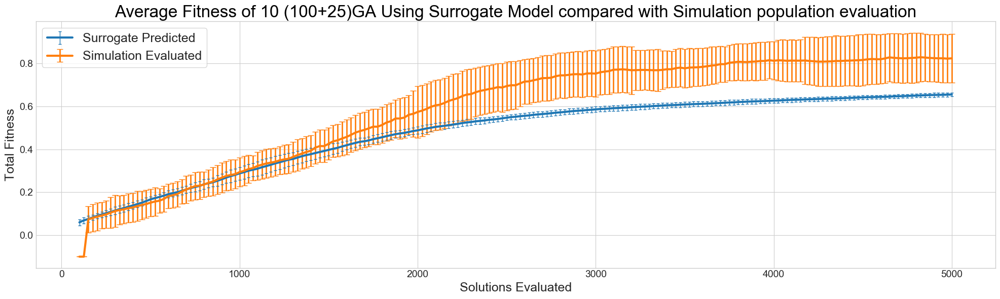

# Surrogate Models
<!-- @todo remove this slide. -->
.col-6[
.smaller[
+ Train **Surrogate Models**
    + Machine learning models which *predict the output of a complex system simulation*
    + Useful for calibration, validation, optimisation, etc 
+ I.e. Search parameter space using surrogate model
    + Simulate interesting parameters sets
    + Much faster than simulating whole parameter space
]
]
.col-6[
.smaller[
+ Transport simulation surrogate model 
+ Train with:
    + Real-world data
    + Simulated data
        + **including low-frequency events**
+ *Accurate*, *Robust* predictions

+ **James Pyle** [jcbpyle1@sheffield.ac.uk](mailto:jcbpyle1@sheffield.ac.uk)
]
]
.col-9[

]
.col-3[
.smaller[
+ Genetic Algorithm driven search
+ Simple Neural Network surrogate
+ 500x faster than simulation
    + Less accurate
]
]

---
